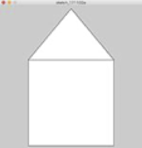

**Introduction to Coding** 

Prof. Dr. Lena Gieseke | l.gieseke@filmuniversitaet.de | Film University Babelsberg *KONRAD WOLF*

Winter Term 20/21

---

# Session 01 - Introduction

## Learning Objectives

With this session, you will

* know what to expect from the course,
* understand what programming is about,
* be able to work with the p5 online editor and the class environment,
* understand commands, and
* be able to draw stuff.

## Scripts

* [Introduction](../../02_scripts/itc_ws2021_01_intro_script.md)
* [Setup](../../02_scripts/itc_ws2021_02_setup_script.md)
* [Drawing](../../02_scripts/itc_ws2021_02_drawing_script.md)

## Setup

1. Create a account with [OpenProcessing](https://www.openprocessing.org)
2. Sign up to the [class](https://www.openprocessing.org/class/64768) (Code: 296C39)

## Assignment

1. Draw the following house by combining shapes. 
2. Draw the same house with beginShape and endShape. 

3. Draw a creative self-portrait with simple shapes.

Submit your sketches under `Assignment 01 - Drawing` in the OpenProcessing [class](https://www.openprocessing.org/class/64768).