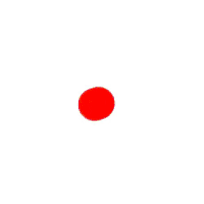

**Introduction to Coding** 

Prof. Dr. Lena Gieseke | l.gieseke@filmuniversitaet.de | Film University Babelsberg *KONRAD WOLF*

Winter Term 20/21

---

# Session 03 - Variables

## Learning Objectives

With this session you 

* understand how to work with data, and
* understand what the scope of a variable is, and
* how animate certain properties, such as color and position.

## Video

[Here](https://e.pcloud.link/publink/show?code=XZew87ZVbUKYHqidUXKJozrV1wLRHNH88Gk) you find the recoding of the session. The recording is only for members of this course. You are not allowed to share it.

## Script

* [Script 05 - Variables](../../02_scripts/itc_ws2021_05_variables_script.md)

## Assignment

### 03.01 Variables

Read the [script]((../../02_scripts/itc_ws2021_05_variables_script.md)) and make sure that you fully understand how to work with variables. Also read through the rest of the [script](../../02_scripts/itc_ws2021_05_variables_script.md) and understand operators and color systems.

Put effort into working through the steps of application example [Color Animation](https://www.openprocessing.org/sketch/1024171) (it is also in the script).

### 03.03 Basic Animation of The Position

Start with [03.06 - The Color Spectrum - Step 04](https://www.openprocessing.org/sketch/1024185#).

Now, we want to animate the movement of the circle. Meaning, the circle should move on its own and not follow the mouse anymore.

The result should look somewhat like the following:

The steps to animate the position of the circle are similar to the steps we made for animating the color.

1. We need two new variables for both coordinate in x and y, e.g. `positionX`, `positionY`.
2. With each `draw()` call increase the value `positionX`, `positionY`.
     * For that add two new variables `stepX`, `stepY`
3. Setup up conditions to check for the boundaries of the sketch canvas.
    * You get the canvas size with the system variable `width` and `height` 
    * If it is moving out of the canvas, let’s switch direction.

### 03.04 Advanced Improvements (Optional)

1. Randomize the step value, so that every time we start the program, we get a different animation.
    * Do this in `setup()`.
    * Assign a random value within a suitable range to `stepX`, `stepY` each.
2. For a more precise boundary check, check the "collisions" with the sketch window limits not with the center of the circle, as it is now, but incorporate the radius of the circle into the check. Then the circle will bounce off its sides and not slightly move out of the window anymore.

### 03.05 Freestyle (Optional)

What else could you animate in this basic example?

---

Submit your sketches under `Assignment 03 - Animation` in the OpenProcessing [class](https://www.openprocessing.org/class/64768).

