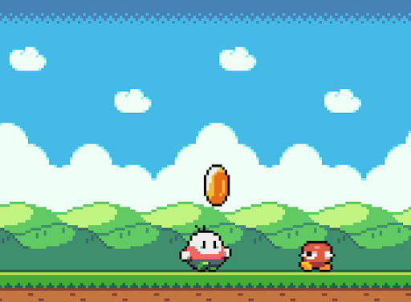

**Introduction to Coding** 

Prof. Dr. Lena Gieseke | l.gieseke@filmuniversitaet.de | Film University Babelsberg *KONRAD WOLF*

Winter Term 20/21

---

# Session 05 - Arrays

## Learning Objectives

With this session you

* understand the logic behind arrays, and
* know how to use them.


## Video

[Here](https://e.pcloud.link/publink/show?code=XZxCW7ZcQqz0IIdLGpbffem92nGkmjLzVkk) you find the recoding of the session. The recording is only for members of this course. You are not allowed to share it.


## Script

* [Script 07 - Arrays](../../02_scripts/itc_ws2021_07_arrays_script.md)
* Go over the script and the confetti example and make sure that you understand how to work with arrays.

## Assignment

With this exercise we want to take the first step for implementing a simple "Jumping Game". The result at the end will look something like [this](https://www.openprocessing.org/sketch/1035457) (of course you will be able to modify it anyway you want...).

[](https://www.openprocessing.org/sketch/1035457)

## 05.01 Jumping Game - The Jumping

As a first step we will implement the jumping. We will do so with a simple circle and the result of this assigment will look like [this](https://www.openprocessing.org/sketch/1038264) (use the up arrow key to jump).  Next lesson you will learn how to substitute the circle with images.

In the following we are giving you all the steps needed for the exercise. You simply need to put it together and understand each step.

1. The environment

Set the canvas size to (480, 360) and the background to white (inside of draw).


2. The Player

Think about it for a second: which variables do we need for the player?

For now, we will add the following global variables for the player

```js
// Player Variables
let playerX = 0; // Current position
let playerY = 0;
let playerSize = 50; // The player as the same width and height
```

And use these to draw the player:

```js
function draw() {
    // For now we are drawing the player
    // as a circle
    fill(255, 0, 0);
    circle(playerX, playerY, playerSize);
}
```

3. The Player's Start Position

We want to position the player at the middle of the screen, on the ground. Remember that "the ground" is here in y the value of `height` as the coordinates go from the top (0) to the bottom (height) of the canvas. Hence, we have to subtract from `height` the size of the player for putting the player on the ground.

```js
function setup() {
    createCanvas(480, 360);

    // Place the player
    // at the middle of the screen in width...
    playerX = width * 0.5;
    playerY = height - (playerSize * 0.5);
}
```

4. Adding a "On the Ground" Variable

Because we are using the value of the player being on the ground over and over again, let's save it in a global variable. Then the system only needs to compute the value once and we reuse it after that through the variable.

```js

...
let playerYOnGround = 0; // We need this position over and over again, so let's save it

function setup() {
    createCanvas(480, 360);

    // Place the player
    // at the middle of the screen in width...
    playerX = width * 0.5;

    // ...and at the bottom in height.
    // The bottom of the canvas equals height
    // and we need to move down half the playerSize
    // to place the circle exactly at the bootom border.
    // Wee will need this value over and over again and because
    // of that we save it in a variable so that 
    // we do not need to recompute it.
    playerYOnGround = height - (playerSize * 0.5);
    playerY = playerYOnGround;
}
```


5. Adding the Jumping Status

Now, we want to add the key input for activating the "jumping". For that we add a global variable jumping, which is either false, if we are not jumping, or true, when we are jumping. We set that variable in a keyPressed() function and check for its value in draw (where we eventually want to do the jumping - which is adjusting the position of the player).

For the up arrow we need the system variable `keyCode` for special keys. You can find it in the [reference](https://p5js.org/reference/#/p5/keyPressed).

```js

...

// Jumping Variables
let jumping = false; // Are we currently jumping? Set to true while the player is jumping

...

function draw() {

    ...

    if (jumping) {      
        print("We started to jump");
    }
    ...
}


// Key input for controlling the jump:
// the up-arrow key makes the
// player jump
function keyPressed() {

    if (keyCode == UP_ARROW) {

        jumping = true; // This will trigger to compute the jumping movement in setup()
    }
}

```

6. The Jumping Up

The actual jumping works as follows: we have a variable `jumpHeight`, which tracks the current jumping height of the player in each frame and a variable `jumpStrength`, which tracks the value that we want to add to the jumpHeight (similar to step for the previous circle animation example) in each frame. The jumping is then computed in each frame by adjusting the jumpHeight with jumpStrength and subtracting the `jumpHeight` from `playerYOnGround` to get the final postion.

Also, we add the global variables jumpStrengthMax, which is a constant value for controlling the initial speed of the jumping.

```js
...

// Jumping Variables
let jumping = false; // Are we currently jumping? Set to true while the player is jumping
let jumpHeight = 0; // The current height of the player in each frame
let jumpStrength = 0; // Value that we add the the player's position for the jumping
let jumpStrengthMax = 5; // Constant value, controlling the speed of the jumping


...


function draw() {

    background(255);


    if (jumping) {
        jumpHeight += jumpStrength;
    }

    playerY = playerYOnGround - jumpHeight;

    fill(255, 0, 0);
    circle(playerX, playerY, playerSize);
}

function keyPressed() {

    if (keyCode == UP_ARROW) {

        jumping = true; // This will trigger to compute the jumping movement in setup()
        jumpStrength = jumpStrengthMax; // Start the jump with maximal strength
    }
}
```

Now, the player should move up when we press the up arrow.

7. The Coming Down

We need to make sure that the player comes down at some point. So we need to make the value jumpStrength negativ, so that the direction of the movement is reversed and the player moves down again (once again, similar to reversing step in the previous circle animation example). For that we add the constant global variable `gravity` and subtract `gravity each frame from jumpStrength. Then at some point jumpStrength will become negative and the direction of the jump in reversed.


```js
...

let gravity = 0.1;

...

    if (jumping) {
        jumpStrength -= gravity;    
        jumpHeight += jumpStrength;
    }
    playerY = playerYOnGround - jumpHeight;

...
```

Now, the player should move back down again at some point after the jump.


8. Landing

For making the coming down stop at the ground we check whether `jumpHeight <= 0` (which it is when the player is back on the ground) and set `jumping` to `false` and `jumpHeight` and `jumpStrength` to zero. Then the jumping activity is over.


```js
    if (jumping) {
        jumpStrength -= gravity;    
        jumpHeight += jumpStrength;

        if (jumpHeight <= 0) {
            jumping = false;
            jumpHeight = 0;
            jumpStrength = 0;
        }
    }
```

9. Cosmetics

Usually a "force" such as jumpingStrength is slightly reduced each frame to further slow the movement down. Adding a small factor to slow down the movement makes it look more natural. However, this step is really just cosmetics. We can make the movement look anyway we want.

```js
    if (jumping) {
        jumpStrength *= 0.99;   
        jumpStrength -= gravity;    
        jumpHeight += jumpStrength;

        if (jumpHeight <= 0) {
            jumping = false;
            jumpHeight = 0;
            jumpStrength = 0;
        }
    }
```


---

Submit your sketches under `Assignment 06 - Jumping Game Step 01` in the OpenProcessing [class](https://www.openprocessing.org/class/64768).


