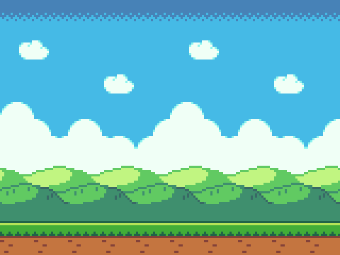

**Introduction to Coding**

Prof. Dr. Lena Gieseke | l.gieseke@filmuniversitaet.de | Film University Babelsberg *KONRAD WOLF*

Phil Clausen | phil.clausen@filmuniversitaet.de | Film University Babelsberg *KONRAD WOLF*

Winter Term 20/21

---

# Session 07 - Image Manipulation

## Learning Objectives

With this session you

* understand how to manipulate images.


## Video

[Here](https://owncloud.gwdg.de/index.php/s/QfCq672FjQpLdrs) you find the recording of the session. The recording is only for members of this course. You are not allowed to share it.


## Script

* [Script 09 - Images](../../02_scripts/itc_ws2021_09_images_script.md)


## Assignment

### 07.01 Image Manipulation

Choose an image of your liking and manipulate it in a creative way by coding. You can use one of the techniques shown in class or find your own.

### 07.02 Jumping Game: Background Animation

With this assignment we will create an animated background for our Jumping Game. Use the [solution of the last assignment](https://www.openprocessing.org/sketch/1042950) or your own version of the game as your starting point.

1. Download the provided background image or find your own

[](files/background.png?raw=true)

[Download](files/background.png?raw=true)

Our plan is to display this image two times next to each other. We are constantly moving it to the left until one of them left the screen completely. Then we put it back to right side of the other image to create an infinite loop.

2. Create a new tab for the background code and upload the image file

3. Create the background variables

Now create the variables we need for the animated background: the image bgImg which we use for both background parts and their X positions `bg1X` and `bg2X`. We also create a variable for changing how fast the background is moving: `bgSpeed`. And because our background image is showing a ground level the player should walk on, we store the ground's height of 45px (from the bottom) in `bgGroundHeight`.

```js
// Background variables
let bgImg; // Background image
let bg1X = 0; // X position of first background
let bg2X = 0; // X position of second background
let bgSpeed = 1; // Speed of background animation
let bgGroundHeight = 45; // Visible ground height
```

4. Create and call `loadBackground()`

In `loadBackground()` we load our image file. Don't forget to call this function in the `preload()` function in the main tab.

```js
function loadBackground() {
	bgImg = loadImage("background.png");
}
```

5. Create and call `initBackground()`

In `initBackground()` we need to initalize only one variable: `bg2X`. When the sketch starts we want to place the second image right next to the first, thus we set its X position to the width of our background image. `initBackground()` should be called in our `setup()` function.

```js
function initBackground() {
	// To get an infinite loop of the moving background
	// we display it two times and shift the second image
	// to the right end of the first.
	// For that we need to initialize its X position
	// as the width of the image:
	
	bg2X = bgImg.width;
}
```

6. Create and call `animateBackground()`

Now we create a new function called `animateBackground()`. In there we draw the background image two times at the calculated positions:

```js
// Draw background
image(bgImg, bg1X, 0);
image(bgImg, bg2X, 0);
```

Then we move both of them to the left by subtracting `bgSpeed`. Set its value higher to move the background faster and vice versa.

```js
// Move both images to the left constantly
// by subtracting the bgSpeed variable
// from their X position
bg1X -= bgSpeed;
bg2X -= bgSpeed;
```

If we would leave it like this our images would just leave the screen (when `bg1X`/`bg2X` get smaller than 0). To prevent that we then need to put them back to the right side by setting their X positions to the image width.

```js
// We need to put back the images to the right side
// when they left the screen at the left side
// by setting their X position to the image width
if (bg1X <= -bgImg.width) {
	bg1X = bgImg.width;
} else if (bg2X <= -bgImg.width) {
	bg2X = bgImg.width;
}
```

We call `animateBackground()` in our `draw()` function. It's important to draw the background before drawing the player, otherwise we would just see our background image overlapping everything else.

7. Move up the player to the visible ground height

In the last assignment we created `initPlayer()` where we calculate the Y coordinate of our player, `playerYOnGround`. Subtract `bgGroundHeight` here to move the player up to the ground height which is shown on the image instead of displaying the player at the bottom of the sketch.


If you followed these steps you now should have an animated background like [this](https://www.openprocessing.org/sketch/1052099).


---

Submit your sketches under `Assignment 07.01 - Image Manipulation` and `Assignment 07.02 - Jumping Game Step 03` in the OpenProcessing [class](https://www.openprocessing.org/class/64768).