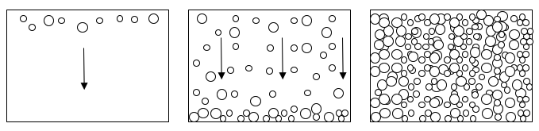

**Introduction to Coding** 

Prof. Dr. Lena Gieseke | l.gieseke@filmuniversitaet.de | Film University Babelsberg *KONRAD WOLF*

Winter Term 20/21

---

# Session 08 - Check-In

We now have worked through all syntax and language constructs that were proposed in the intro script:

* Commands, variables
* Events
* Conditions
* Loops
* Arrays
* Functions

Congratulations... you made it this far 🎉 

We are also almost through the application topics:

* Drawing, colors
* Interaction
* Movement / Animation
* Text and Typography
* Image, video
* Sound

with only text, video and sound missing.

Take a moment to re-capture everything we have covered so far and check wether you have any open questions? Anything you want to go over again? I will ask for any open questions in regard to whichever topic next week in class one more time.

Also, assignment 08.02 Jumping Game Step 4 - Coins is a good check to which parts still might be unclear to you, as that assignment is somewhat more open, with less specific instructions.

## Assignment

This assignment is due January 19th.

### 08.01 Final Project - Plan

It is time to think about a final project! This project can be anything you like. It doesn't need to be useful but it can also just be pretty, fun and/or completely useless ([one of my favorite websites of all time](http://make-everything-ok.com/), or [why you should make useless things](https://www.ted.com/talks/simone_giertz_why_you_should_make_useless_things)). But of course you can also code something practical that you can actual use... 🙂

The  workload of the final project depends on the number of LPs you want to achieve. Please indicate on your submitted project plan how many LPs you are planning on. 1 LP amounts to ~30h of work. As you will encounter many unexpected problems along the way, you should double your planned time automatically. This means if you think you can complete your project in 5 workdays, which are 40h in total, you should directly plan with 80h in total.

Projects are allowed to be based on existing code (from the lecture, exercises, the internet, etc.) or reuse parts of existing code. You are also allowed to work in teams, but then it should be clear in advance who is responsible for which part of the project.

Ultimately you should have a project plan, which summarizes the expected result as well as a description of the steps that are needed to archive the result. You might even do some drawings to make things clearer.

---

## Example Project Plan  

The following would be a good plan. Before the actual implementation I would probably further clean and refine it. But if you are more the trial-and-error type of person, then that is fine too and the below level of detail is fine.

### Filling a box with confetti

Upon starting the program, spheres of different sizes and colors should continually "rain" down the sketch window from the top to the bottom. Above the ground (the bottom of the sketch window) the confetti should pile up and and the space should slowly fill up with confetti.



Goal 1: Confetti 

* Spheres of different sizes and colors
    * Nice to have: different speeds
* Moving into the frame from the top (starting outside of the window)
* Continue moving down the screen

Goal 2: Rain

* Spheres should continue to appear moving into the frame from top to bottom

Goal 2: Hitting the ground and laying on it

* Sphere-ground collision detection (detect when a sphere is hitting the ground)
* Stop the sphere's movement
* (after this step all spheres will end up on top of each other)

Goal 3: Piling up on the ground

* Sphere-sphere collision detection (detect when a sphere is colliding with another sphere)
    * How is this behaving during the "falling-phase"?
* Detect the "ground level" of spheres
* Stop a sphere's movement when there is a collision of a sphere with a sphere on the ground level
    * Is just the first collision fine, or do we have to specifically detect the ground-level of spheres?

Goal 4: Stop once full

* Detect whether the "ground level" of spheres is above a certain distance threshold to the top edge of the sketch window.

---

The final project plan is only due by February 2nd. For next week come up with an idea that you think you can manage. If you have more than one idea, submit all ideas you have. Submit ideas by email to me: l.gieseke@filmuniversitaet.de  
Be as detailed as you can be at this point and add all questions, comments, etc. that you might have.

## 08.02 Jumping Game Step 4 - Coins 

In this step, we are adding coins to the game, which the player can collect. See the solution for how it should look like. You can start with your code or the solution code from Jumping Game Step 03.

This task consists of two parts:

* Distribute coins in the world.
* Let the player be able to collect coins.

The instructions below are intentionally left much more open than so far. This if for you to challenge yourself to come up with the right code on your own. All needed code pieces we have used in one form or the other before. However, I would like to encourage you to really think about how you would implement it, instead of just looking for the right code to copy. If you get stuck, no worries! We will go over the solution together in the next class.

### Distribute Coins In The World

The background is animated to move from the right side of the screen to the left, which make the player appear to be running to the right. We want the coins to be placed in the world, hence we also need them to appear at the right side of the screen, animated to move from the right to the left.

1. Download the provided coin images or find your own images.

[](files/coin-0.png?raw=true)[](files/coin-1.png?raw=true)[](files/coin-2.png?raw=true)[](files/coin-3.png?raw=true)

[Download Coin 0](files/coin-0.png?raw=true)  
[Download Coin 1](files/coin-1.png?raw=true)  
[Download Coin 2](files/coin-2.png?raw=true)  
[Download Coin 3](files/coin-3.png?raw=true)  

2. Create a new tab for the coin code (e.g. `coin`) and upload the image files.

3. Display the animated coin images

As an in-between step, we want to simply display the animated coin in the middle of the screen. We have displayed images before for the player and the background. Try to make it work for the coin on your own... F

For that you can copy e.g. the suitable code from the player and rename it accordingly. You need the variables for the coin's position, size (the coin size is 48), and its image (e.g. the array for the images), and the functions to load, init and animate. Don't forget to add the new functions also to `setup()` and `draw()` in the main sketch tab.

4. Move the coin with the background

For the final placement of the coins, we want one coin to appear on the right side of the screen and moving it with the background to the left. 

* For that we first change the start position in the `initCoin` function. For the coin's y position create a random value - which makes sense. This means the coin should be above ground and not too high. We place the coin in x to `bgImg.width` so that it is placed on the right side, outside of the screen. 
* Now, we want to move the coin in animateCoin in x in the same way as we are moving the background. Here, you can simply reuse the `bgSpeed` variable.
* Lastly, when the coin moves out of the screen on the left in x, it should be moved back to the right side of the screen (where it starts) so that is can reappear. For that check whether the coin is out of the screen on the left side, and if so, call `initCoin()` again (which places the coin on the right).

We are done with distributing coins in the world! ✓

### Let The Player Be Able To Collect Coins

For now, we simply want a coin to disappear ("being collected") when the player collides with it. We will add counting points later.

* For tracking whether a coin is collected or not, add in the coin tab a global variable for that, e.g. `coinCollected` and set it to `false`.
* Think about it for a moment how you could detect a collision between the player and the coin. Feel free to use your own solution for that. One possibility is to set a collision to `true`, if the distance between the player and the coin positions is equal or less than both of their "radiuses" (half their size). You can implement this with the following code and the given [dist function](https://p5js.org/reference/#/p5/dist):

```js
    if (dist(coinX, coinY, playerX, playerY) <= playerSize/2 + coinSize/2) {
        coinCollected = true;
    }
```

Add the above code to the `animateCoin` function. You can check if the function works correctly, e.g. by a printout to the console.

What should happen when the player collides with a coin? Well, the coin should disappear (later we will count the collected coins) and a new coin should appear on the right side of the screen. For that we can simply call the `initCoin` function. And we already have the code for that in the `animateCoin` function for the case of the coin moving outside of the screen on the left. To this check we can add a condition which checks for `coinCollected` to be true and modify the "out of screen check" from step 4 to the following:

```js
    // Give the coin a new position when it left the screen or got collected
    if (coinX <= 0 - coinImg[1].width || coinCollected) {
        initCoin();
    }
```

Make sure that the above code comes after the `if (dist(...)){}` check. Also, very important: we also need to set `coinCollected` back to false (otherwise no new coins will re-appear). Add that to the `initCoin()` function.

We are done with collection of coins! ✓

---

Submit your sketches under `Assignment 08 - Jumping Game Step 04` in the OpenProcessing [class](https://www.openprocessing.org/class/64768).


