**Introduction to Coding**  


Prof. Dr. Lena Gieseke | l.gieseke@filmuniversitaet.de | Film University Babelsberg *KONRAD WOLF*

---

# Script 03 - Drawing

* [Script 03 - Drawing](#script-03---drawing)
    * [Commands](#commands)
        * [Hello World II](#hello-world-ii)
    * [System Loop](#system-loop)
    * [Drawing](#drawing)
        * [Create Canvas](#create-canvas)
        * [Pixel](#pixel)
        * [Coordinate (x,y)](#coordinate-xy)
        * [Drawing Commands](#drawing-commands)
            * [Line](#line)
            * [Triangle](#triangle)
            * [Rectangle](#rectangle)
            * [Ellipse](#ellipse)
            * [Quad](#quad)
            * [Arc 🤓](#arc-)
            * [Polygon](#polygon)
        * [Colors](#colors)
            * [RGB](#rgb)
            * [Alpha](#alpha)
            * [Color Commands](#color-commands)
    * [Getting Help 🚒](#getting-help-)
    * [References](#references)

---

Now, you are learing how to draw these friendly fellas:


## Commands

Remember? Hello World!

```js
point(10,10);
```

The above statement is called a command.  

A program is a list of commands, with which you are telling p5 what to do, e.g.:

```js
Dear p5, please draw a point at the location (10, 50)!
```

is in p5:

```js
point(10,50);
```

The command consists of three parts

1. `point` describes the overall task
    * **Draw a point!**
2. The two arguments `(10, 50)` give more details to the task
    * **At location 10, 50**
3. The semicolon indicates the end of the command
    * Semicolons are optional in p5 and JavaScript. I recommend to place them (they are essential in many other programming languages).  

### Hello World II

```js
print("Hello World!");
```

With `print` you can send text to the console:

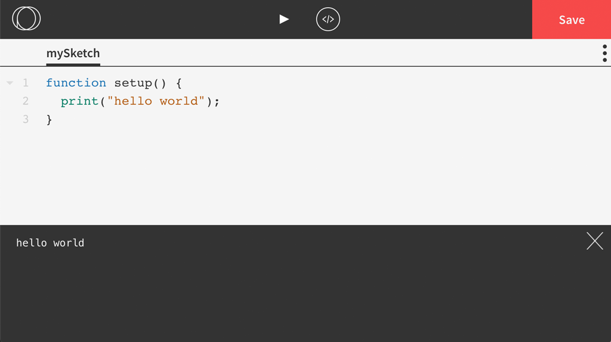

This is useful to set checkpoints in your program and to print the values of variables. We will come back to this.


[[07]](http://michaelkipp.de/processing/01%20zeichnen.html)

Why is there a counter counting up in the console when printing?

## System Loop

In p5 a sketch **must** include the following base structure, defining the `setup()` and `draw()`, which are so called *functions*:

```javascript

function setup() {

    [HERE YOU WRITE YOUR CODE]
}


function draw() {

    [HERE YOU WRITE YOUR CODE]
}
```

`setup()`

* This command executed once when the program is started

`draw()`

* Executed as soon as setup() is done.
* Called again and again until the window is closed or the execution stopped.
* By default 60 frames are displayed in a second.

You have to accept the structure as given from the p5 gods. You must not change it and use it exactly as is, with all words and parenthesis.

## Drawing

### Create Canvas

For being able to display something, you have to create a canvas. You must do that inside of the `setup()` function:

```javascript

function setup() {

    createCanvas(100, 100);

}

function draw() {

}
```

* The values change the size of the canvas.
* You can use the variables `windowWidth` and `windowHeight` for automatically detecting the current size of the display window.


### Pixel

The canvas is a grid of small rectangles that combined make up the image. These rectangles are called pixel (picture element). To create an image you have to assign a color to each pixel

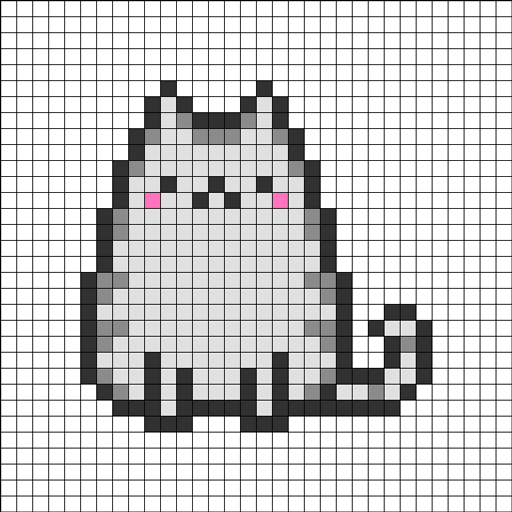

Thankfully, p5 give us many convenient drawing functions so that we don't have to color each pixel individually.

[[07]](http://michaelkipp.de/processing/01%20zeichnen.html)

### Coordinate (x,y)

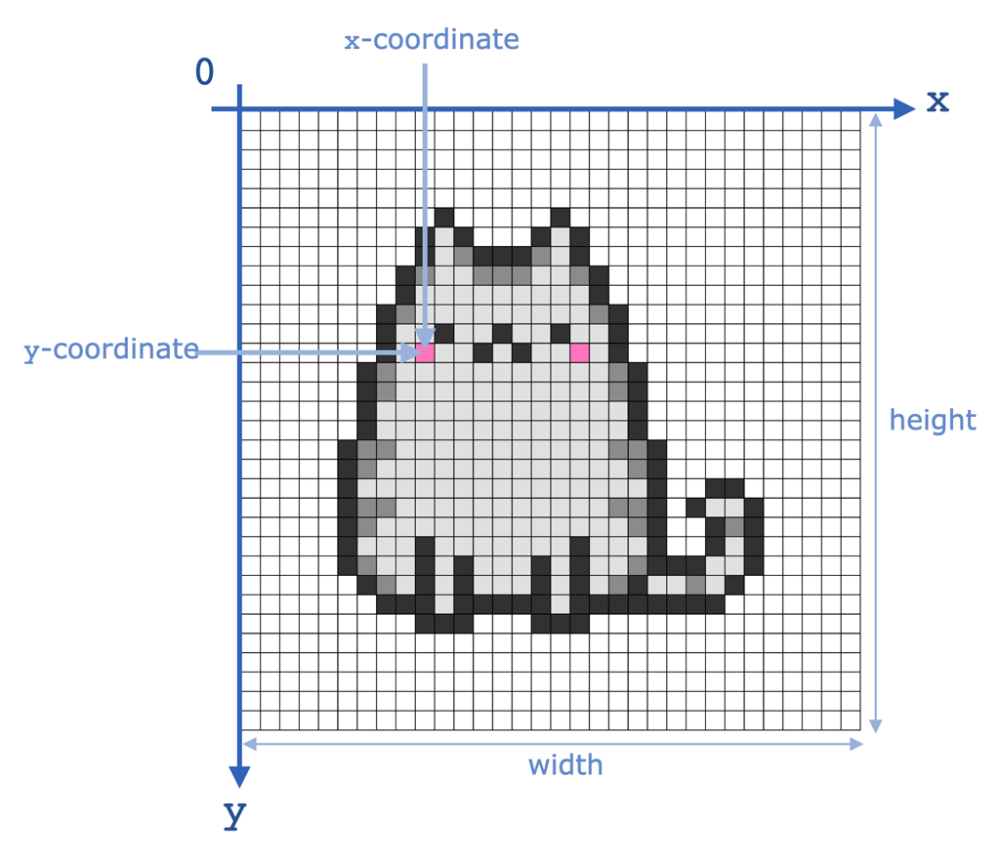

Where is to following ellipse drawn?

```js
function setup() {

    createCanvas(500, 500);
}

function draw() {

    ellipse(100, 400, 20, 20);
}
```

### Drawing Commands

A typical drawing command could look for example as follows:


**The order of the parameters is fixed and must be followed!**

#### Line

```js
line(x1, y1, x2, y2);
```

Arguments:

* Start `(x1, y1)`
* End `(x2, y2)`

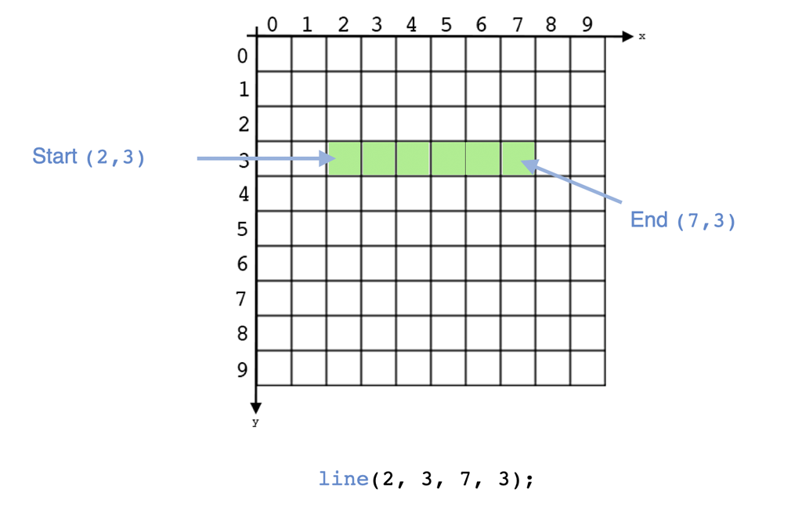

#### Triangle

```js
triangle(x1, y1, x2, y2, x3, y3)
```

Arguments:

1. corner `(x1, y1)`
2. corner `(x2, y2)`
3. corner `(x3, y3)`

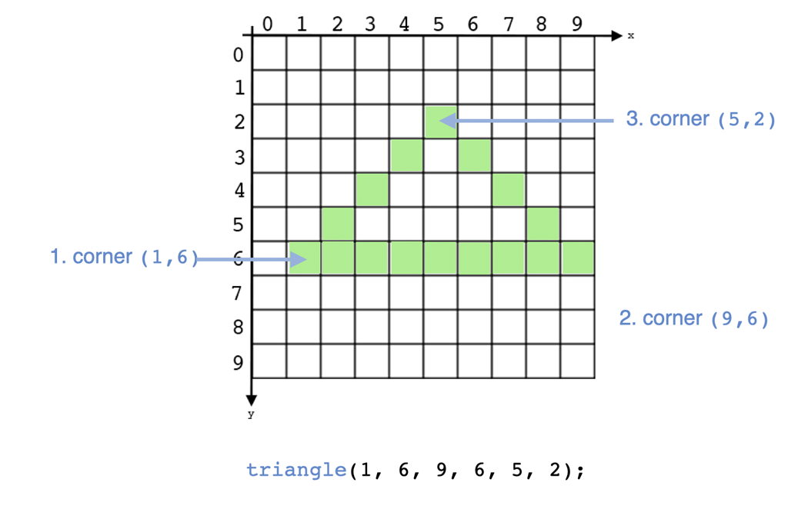


#### Rectangle

```js
rect(x1, y1, breite, hoehe)
```

Arguments:

* Top, left corner `(x1, y1)`
* width
* height

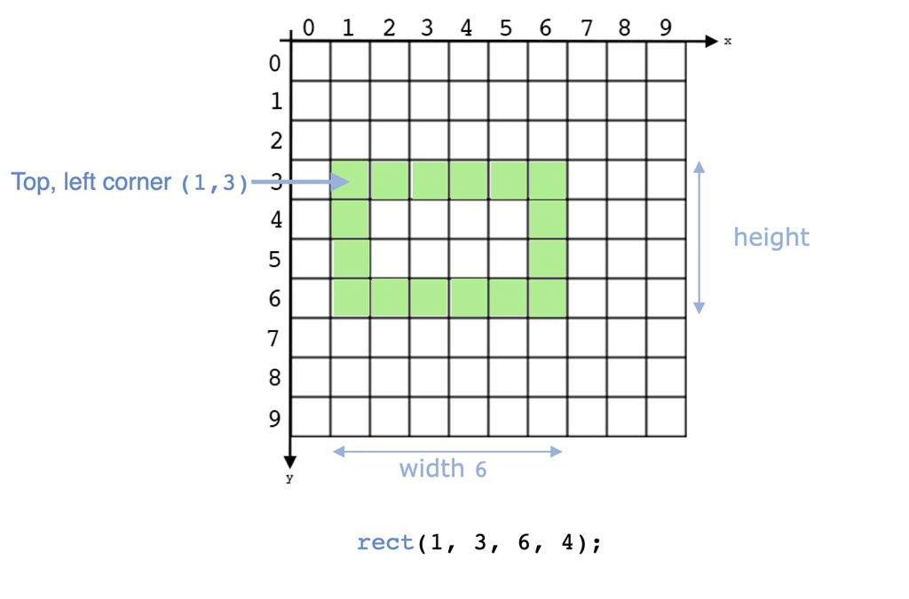


#### Ellipse

```js
ellipse(x, y, diameterWidth, diameterHeight);
```

Arguments:

* Center point `(x, y)`
* diameterWidth
* diameterHeight

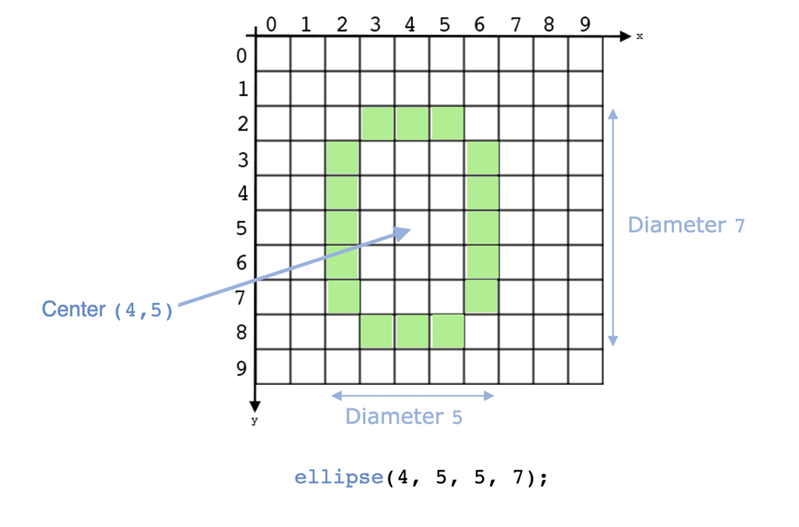


#### Quad

```js
quad(x1, y1, x2, y2, x3, y3, x4, y4)
```

Arguments:

1. corner `(x1, y1)`
2. corner `(x2, y2)`
3. corner `(x3, y3)`
4. corner `(x4, y4)`

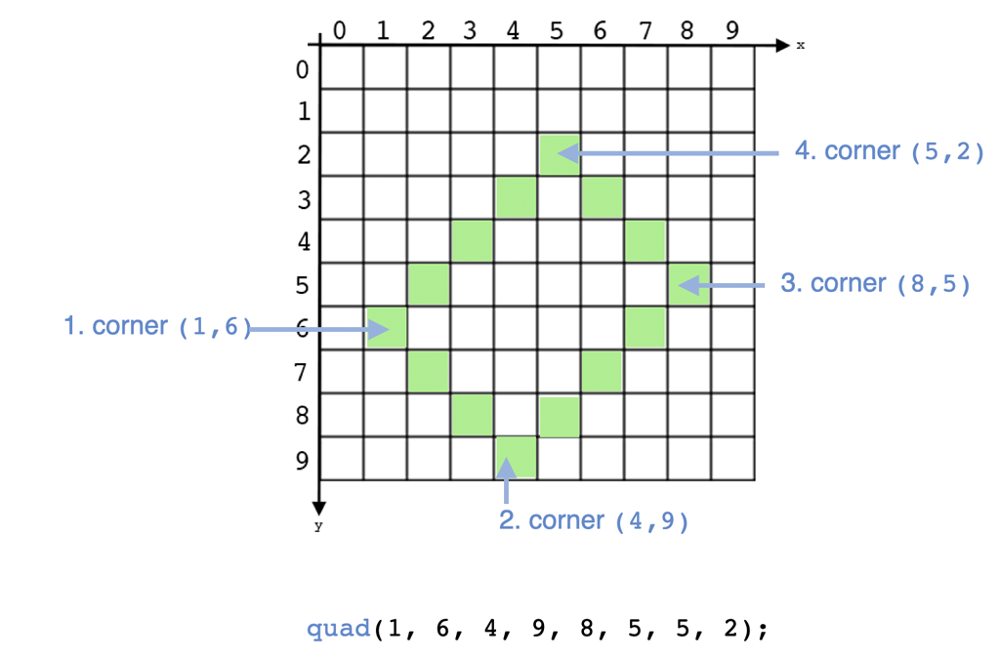

#### Arc 🤓

```js
arc(x, y, width, height, alpha, beta);
```

Arguments:

* Center `(x1, y1)`
* `width`
* `height`
* Angle where to start `alpha`
* Angle where to end `beta`
    * Angles are in radians
    * 360° are 2*π


##### Degrees vs. Radians 🤓

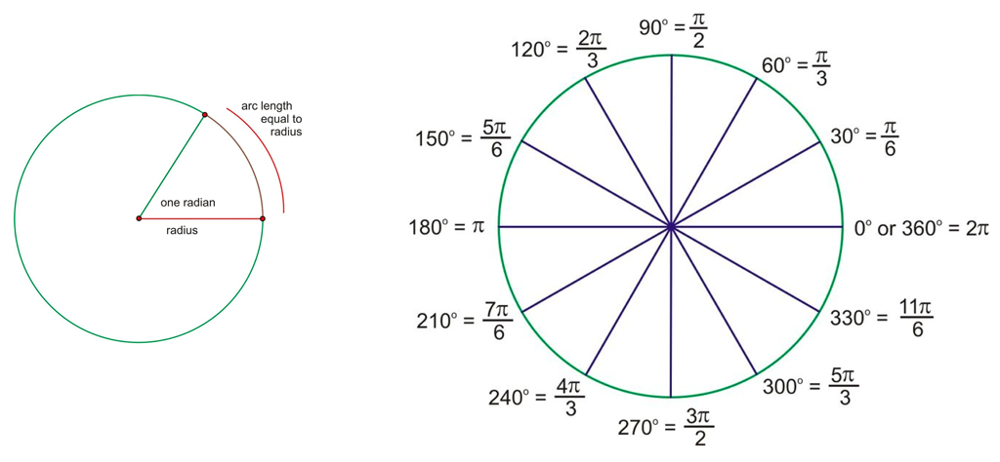

[[2]](https://www.ck12.org/book/CK-12-Trigonometry-Concepts/section/2.1)

<!-- 
Radians are alternate units used to measure angles in trigonometry. Just as it sounds, a radian is based on the radius of a circle. One radian (abbreviated rad) is the angle created by bending the radius length around the arc of a circle. Because a radian is based on an actual part of the circle rather than an arbitrary division, it is a much more natural unit of angle measure for upper level mathematics.

arc length / radius

 -->


##### Examples

```js
arc(4, 5, 5, 7, PI/6, 2*PI - PI/6);
```

* Function `radians()` converts degrees in radians for you

```js
arc(4, 5, 5, 7, radians(30), radians(330));
```

##### Examples

```js
arc(x, y, width, height, alpha, beta);
```

Angles are measured in reference to a line starting at the center, running to the right, clock-wise.

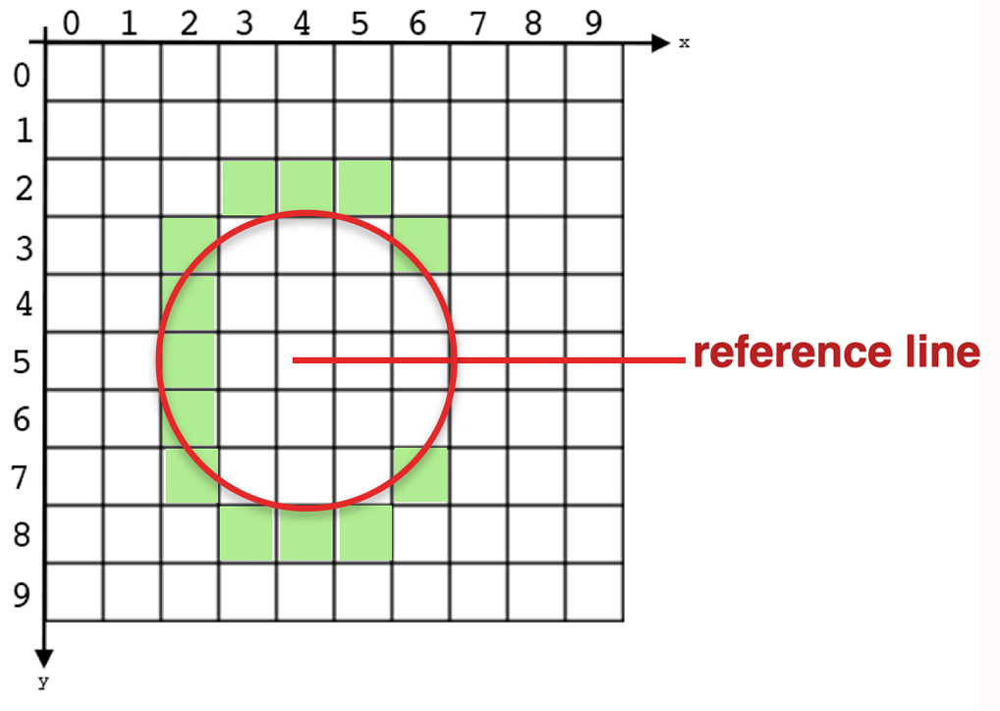

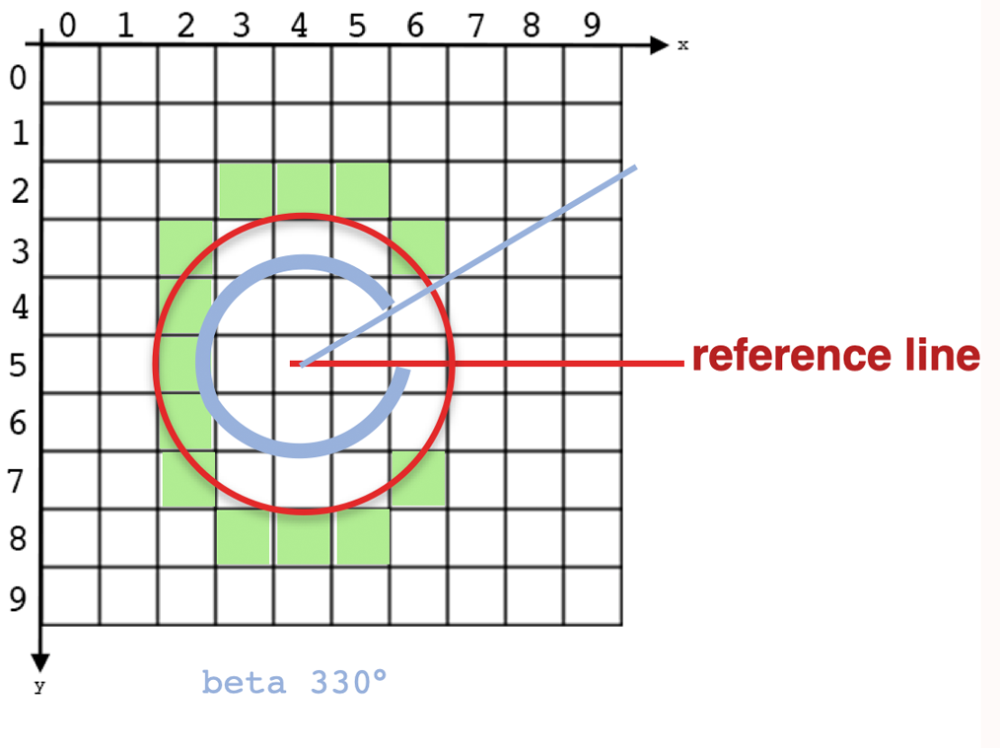

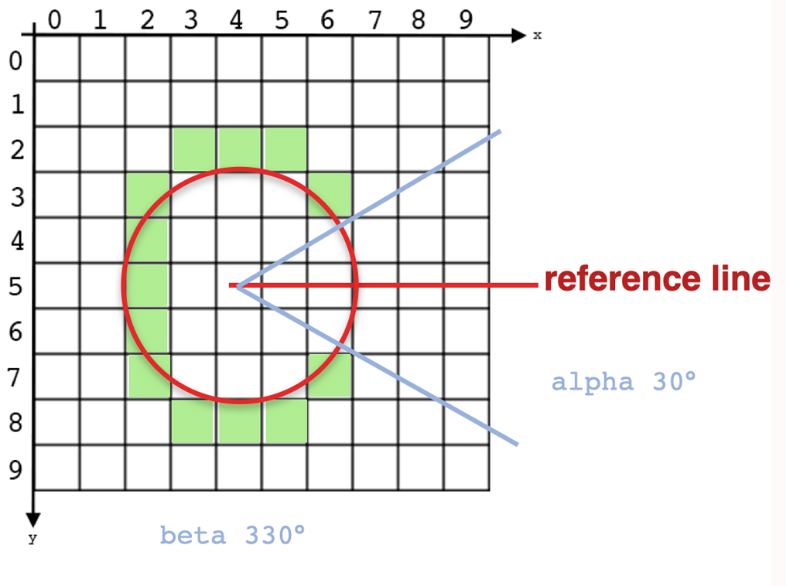

[[1]](http://michaelkipp.de/processing/01%20zeichnen.html)


#### Polygon

* A number of given vertices are connected with a line


* `beginShape` tells Processing that we are giving vertices for a polygon now
* Corners are added with the `vertex` command
* `endShape` ends the definition
    * `CLOSE` tells Processing to close the shape
    * If not given the last and first vertices of the poly are not connected

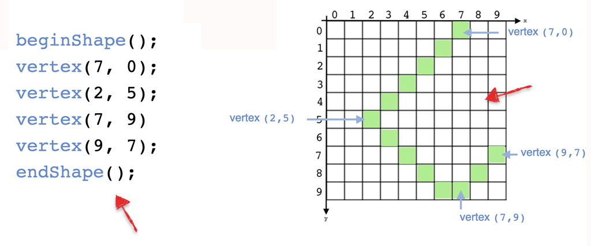


### Colors

#### RGB

By default Processing uses RGBA-color space with

* red, green, blue, alpha
* 0 … 255
* 0 = no color
* 255 = full saturation

Gray has the same value in all three channels.

  
[[tutsplus]](http://cdn.tutsplus.com/active/uploads/legacy/tuts/076_rgbShift/Tutorial/1.jpg)


#### Alpha

Alpha describes the transparency of the, e.g., filling:

* 0 … 255
* 0 = fully transparent
* 255 = fully opaque


#### Color Commands

Setting the background color:

```js
background(r, g, b);
```

Changing attributes of the drawing commands:

```js
fill(r, g, b);
stroke(r, g, b);
strokeWeight(w);
```

These commands function as “turn on”-button and are valid until overwritten or deactivated.

```js
noFill(); 
noStroke();
```


##### Example

```js
// colorCommands.js

function setup() {
    createCanvas(500, 500);

    // Background color of the canvas
    background(0, 255, 0);
}

function draw() {

    // Rectangle left
    fill(255, 0, 0);
    stroke(0, 0, 255);
    strokeWeight(10);
    ellipse(250, 250, 150, 200);

    // Ellipse
    fill(255, 255, 0); 
    noStroke();
    rect(40, 40, 20, 20);

    // Rectangle right
    stroke(0, 0, 0);
    strokeWeight(2);
    rect(440, 440, 20, 20);
}
```


##### Comments

Comments are text, which p5 will ignore when executing your script file. Comments are crucially important for making code more understandable. They are furthermore used for documentation and code testing.

Inline comment:

```js
x = x + 1;  //add border
```

Single line comment:

```js
//fill(r, g, b);
//stroke(r, g, b);
//strokeWeight(w); 
```

Multiline comment:

```js
/* The following computes
…
…
*/
```

## Getting Help 🚒

How is one supposed to know this?

Look it up in the reference: https://p5js.org/reference/

The reference is like a dictionary of the programming language. I recommend to bookmark this page as you will come back to is many, many times.


## References

[[1] M. Kipp: Vorlesungsskript Grundlagen der Programmierung - 1 Zeichnen, Hochschule Augsburg](http://michaelkipp.de/processing/01%20zeichnen.html)  
[[2] CK-12 Foundation: Trigonometry Concepts - 2.1 Radian Measure](https://www.ck12.org/book/CK-12-Trigonometry-Concepts/section/2.1)

---

The End  

👩🏽‍💻 👨🏻‍🎨 