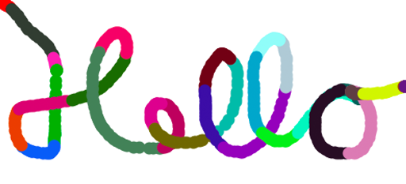

**Creative Coding - Summer School 2019**

Prof. Dr. Lena Gieseke | l.gieseke@filmuniversitaet.de | Film University Babelsberg *KONRAD WOLF*

---

# Script 04 - Program Flow

* [Script 04 - Program Flow](#script-04---program-flow)
    * [Topics](#topics)
    * [Learning Objectives](#learning-objectives)
    * [Program Flow](#program-flow)
    * [Continuing Programs](#continuing-programs)
    * [Functions](#functions)
        * [Function Definition](#function-definition)
        * [Function Call](#function-call)
    * [Commands vs. Command Blocks](#commands-vs-command-blocks)
    * [Interaction](#interaction)
        * [Mouse Interaction](#mouse-interaction)
            * [The `random` Function](#the-random-function)
            * [Careful](#careful)
            * [Mouse Position](#mouse-position)
        * [Keyboard Interaction](#keyboard-interaction)
    * [Example - How to Clear the Screen?](#example---how-to-clear-the-screen)
        * [Problem 1 - If the ‘c' key is pressed](#problem-1---if-the-c-key-is-pressed)
    * [The `if` Statement](#the-if-statement)
    * [The == operator](#the--operator)
        * [Problem 2 - Clear the Screen](#problem-2---clear-the-screen)
    * [The `else` Statement](#the-else-statement)
    * [`while`-Loop](#while-loop)
    * [Summary](#summary)

---





## Topics

* Flow of a program
    * Functions
    * User interaction
    * `if`-condition
    * `while`-condition


## Learning Objectives

With this session you learn different ways to modify the execution flow of a program.  
Specifically you

* understand what a function definition and a function call are,
* understand the difference between a command and a code block,
* know how to implement user mouse and key inputs,
* know how to implement if, if..else, and while conditional statements, and
* with that understand how you can control the flow of a program.

## Program Flow

You can understand the flow of a program as the order in which commands are executed. It is crucially important to understand early on that the order in which you write and organize the code in the code file has little to do with the order in which commands are actually executed. This order depends on constructs such as functions, if- and while-statements.


## Continuing Programs

*Remember?*
  
In p5, we need to define the `setup()` and `draw()` functions:


```javascript

function setup() {

    ...

}

function draw() {

    ...
}
```

By filling these functions with code, we are defining what happens when the commands are called, hence, we define their **functionality**.

But when are we actually calling these commands? Well, in this specific case p5 takes care of calling these commands for us. 

## Functions

Functions define functionality blocks with fixed responsibilities or tasks. Working with functions consists of two parts: the definition of that function and calling that function to execute it.

### Function Definition

To define a function you need the keyword `function` followed by a `functionname` (given or of your choice), followed by `()`, followed by `{...}`. What a function does is enclosed in the curly brackets.

```js
function functionname(){

    // Code that is executed when we call the function
}
```

### Function Call

To execute what is inside of a function, you have to call it. You call a function with its `functionname`, followed by `()`, optional arguments inside of those parenthese, followed by a `;` as last element.

Last week, we have used many different function calls for drawing.

This is the call to the function `line` (also called a *command*)

```js
line(10, 10, 50, 50);
```

But where is the function defined? Well somewhere inside the p5 library. We can just use it and do not need to worry about how it is defined.

```js
// Somewhere inside of the p5 library
// is the function definition 

function line(x1, y1, x2, y2) {
    beginShape();
    vertex(x1, y1);
    vertex(x2, y2);
    endShape();
}
```

Later, we will also write functions from scratch. Don't worry about it too much for now, this is just to complete the example. You can define and call your own, custom made functions:

```js
function theBestLineEverDrawn(){ 

    // Add code
    beginShape();
    vertex(10, 10);
    vertex(20, 20);
    endShape();
}
…

theBestLineEverDrawn(); // Calling the function (-> a command) somewhere in the code
```


## Commands vs. Command Blocks

Commands are single line and end with a `;` such as the following function call:

```js
rect(50,50,100,200);
```

Command blocks have a single “title" line before `{}`

* They don’t have a following `;`
* Neither after the title line, nor after the `{}`

In short: after `{}` there is no `;`.

```js
function draw(){ // "title line"

    // Command block 
    // Do something
}
```

Look at the following example an understand where there are semicolons and where not:

```js
function setup() {
    createCanvas(250, 250);
    background(255); //short-cut for white
}


function draw() {
    fill(0,0,255);
    stroke(255, 0, 0);
    strokeWeight(10);
    ellipse(125, 125, 100, 100);
}
```

The same example with in line comments as explanations:

```js

function setup() { // "title line"

    createCanvas(250, 250);             //command with semicolon
    background(255);                    //command with semicolon
} //end of command block with a curley }, hence there is no semicolon


function draw() { // "title line"
    fill(0,0,255);                  //command with semicolon
    stroke(255, 0, 0);              //command with semicolon
    strokeWeight(10);               //command with semicolon
    ellipse(125, 125, 100, 100);    //command with semicolon
} //end of command block with a curley }, hence there is no semicolon
```

To make code readable certain rules should always be followed:

* One line per command
* Opening curly brackets come after the title line
* Closing curly brackets get their own line
* Indent the content between two brackets


```js
// 02_01_code_readability.js

// Not acceptable,
//...but the code still works:
function setup()
{
createCanvas(400, 400); background(255); }//short-cut for white

function 

draw(){fill(0,0,255);
    stroke(255, 0 , 0);
strokeWeight(10);
             ellipse(125, 125, 100, 100);
}

// Also not acceptable,
//...but the code still works:
function setup() {createCanvas(400, 400); background(255); }function draw() {fill(0,0,255);stroke(255, 0 , 0);strokeWeight(10);ellipse(125, 125, 100, 100);}
```

*On a Side Note:* In the openProcessing editor, the hotkey `command+B` will auto-indent the code, meaning, structure the code properly for you.

## Interaction

```js
// 02.02 Color Circle - Step 1

function setup() {
    createCanvas(250, 250);
    background (255);
    fill(255, 0, 0);
    noStroke();
}

function draw() {
    ellipse(125, 125, 100, 100);
}
```

As the `draw()` function is continuously called, we can make changes to it over time.

Such changes could be based on **user interaction**


### Mouse Interaction

```js

function mousePressed() {

    // Define what should happen
}
```

With the above function definition we can control what should happen if the mouse was pressed. Now we want to do the following:

*If the mouse was pressed, change the color of the circle*

```js
// 02.02 Color Circle - Step 2

function setup() {
    createCanvas(250, 250);
    background (255);
    fill(255, 0, 0);
    noStroke();
}

function draw() {
    ellipse(125, 125, 100, 100);
}

// Called if the mouse was pressed
function mousePressed() {

    // Set the fill color to
    // randomly chosen values
    fill(random(255), random(255), random(255));
}
```


#### The `random` Function

* Generates a random number.
* We call the function, hence use it as a command and the function is defined somewhere in p5.
* Each time the `random()` function is called, it returns an unexpected value within the specified range.
* If only one argument is passed to the function, it will return a float between zero and the value of argument 
    * For example, `random(5)` returns values between 0 and 5 (starting at zero, and up to, but not including, 5)
* https://p5js.org/reference/#/p5/random


#### Careful

*Why does the following not work?*

```js
// 02.03 Color Circle Problem

function setup() {
    createCanvas(250, 250);
    background (255);
}

function draw() {
    fill(255, 0, 0);
    noStroke();
    ellipse(125, 125, 100, 100);
}

// Called if the mouse was pressed
function mousePressed() {

    // Set the fill color to
    // randomly chosen values
    fill(random(255), random(255), random(255));
}
```


#### Mouse Position

We can also use the current mouse position as input. This is not done with a function but with two values, so called **variables** provided by p5. Hence this specific type of variable is called *system variable*.

```js
mouseX
mouseY
```

```js
// 02.04 Color Circle Move

// (the rest of the code remains the same)


function draw() {
    ellipse(mouseX, mouseY, 50, 50);
}
```

### Keyboard Interaction

```js
function keyPressed() {

    ...
}
```
Function that defines what happens if the key was pressed

* (the rest of the code remains the same)

```js
// 02.05 Color Circle Key Input

// (the rest of the code remains the same)


function keyPressed() {

    fill(random(255), random(255), random(255));
}
```


## Example - How to Clear the Screen?

Idea: Pressing the key ‘c' should clear the screen.

*How to do this?* 😱

**Break the problem into subproblems!**

* Problem 1: *If the ‘c' key is pressed...*  
* Problem 2: *...clear the screen.*


### Problem 1 - If the ‘c' key is pressed

**Break the problem into subproblems!**

* Problem 1.1: *If…* 
* Problem 1.2: *Identify the ‘c' key…*

## The `if` Statement

*If… do something.*

This is called a **condition**. It structures the flow of a program.


We check for a condition to be true:

```js
// Pseudo code

if(condition is true) {

    // do this…
}
```

* Notice that this is a command block with curly brackets, hence no semicolon afterwards.

##### Problem 1.2 - Identify the ‘c' key…

Now, we want to check if the condition "key c is pressed" is true

```
// Pseudo code

if(key ‘c' is pressed) {
    Clear the screen…
}
```

For knowing which key is pressed, we can use the system variable `key`, kindly provided by p5.

```js
key
```
We can compare the variable's value with a specific character

```js
key == 'c'
```

## The == operator

* This operator tests *Is equal?*
* Results in `true` or `false`


Finally, we have everything in place to solve problem 1.1. "If the c key is pressed"

```js
// 02.06 Color Circle Clearing

if(key == 'c') {

    //Clear the screen…
}
```

☝🏻 Always test each newly added code snippet individually!☝🏻

*Where do we need to put this line of code in our circle move example?*

Problem 1 ✔️

* Do something when the ‘c' key is pressed


### Problem 2 - Clear the Screen

Let's just fill the background again...

```js
// 02.06 Color Circle Clearing

if(key == 'c') {
    background(255);
}
```

Problem 1 ✔️

* Do something when the ‘c' key is pressed

Problem 2 ✔️

* Clear the screen


## The `else` Statement

You can also define what should happen if the condition in the `if` statement is not true. For that you need to use `else`.

```js
// 02.06 Color Circle Clearing - Step 4

function keyPressed() {

    if (key == 'c') {
        //Clear the screen…
        background(255);
    } else {
        fill(random(255), random(255), random(255));
    }
}
```

You can also create a chain of conditions with adding `else if` blocks:

```js
// 02.06 Color Circle Clearing - Step 5

if(key == 'c') {

    background(255);
}
else if(key == 'b') {

    background(0);

} else {

    fill(random(255), random(255), random(255));
}
```

You can have as many else if statements as you want…

```js
if(value < 10)
{

}
else if(value < 15)
{

}
else if(value < 22)
{

}
else if(value < 32)
{

}
else
{
    //value >= 32
}
```

  
[[quora]]([https://www.quora.com/Can-if-else-be-considered-as-a-loop])


## `while`-Loop

The while loop is closely related to the if-statement. However, the if-statement block is only executed once, if the condition is true. For a while-statement, its code block is executed as long as a condition is true.

```
// Pseudo code

while (condition)
{  
    statement;
}
```

You have to make sure that the condition becomes `false` at some point!!

Otherwise you have created an **infinity loop** 🤬


```js
// 02.07 While Loop

let counter = 0;    // Iteration counter                    
while (counter < 3) // Loop condition
{  
    print(“wow”);     // Loop activity

    counter += 1;       // Increase counter
}
print(“All done…”);
```


[michaelkipp](http://michaelkipp.de/processing/07%20schleifen.html)


```js
// 02.08 Loop Inside Draw


function setup() {
    createCanvas(400, 400);
    background(255);
    fill(255, 0, 0);
    noStroke();
}


function draw() {

    let counter = 0; // Iteration counter
    while (counter < 30) // Loop condition
    {
        ellipse(mouseX + random(30), mouseY + random(30), 2, 2);
        counter += 1; // Increase counter
    }
}


function mousePressed() {

    fill(random(255), random(255), random(255));
}


function keyPressed() {

    if (key == 'c') {
        background(255);
    } else {
        fill(random(255), random(255), random(255));
    }
}
```


## Summary

* Functions define functionality blocks within `{}`
    * Commands are *function calls*
* User Input from
    * `keyPressed()`
    * `mouseX`, `mouseY`
* Structuring the program flow
    * `if(condition is true)`
    * `while(condition is true)`

Use the [reference](https://p5js.org/reference/) 🚒


---

The End  
  
⛵️  🎢  🎡 