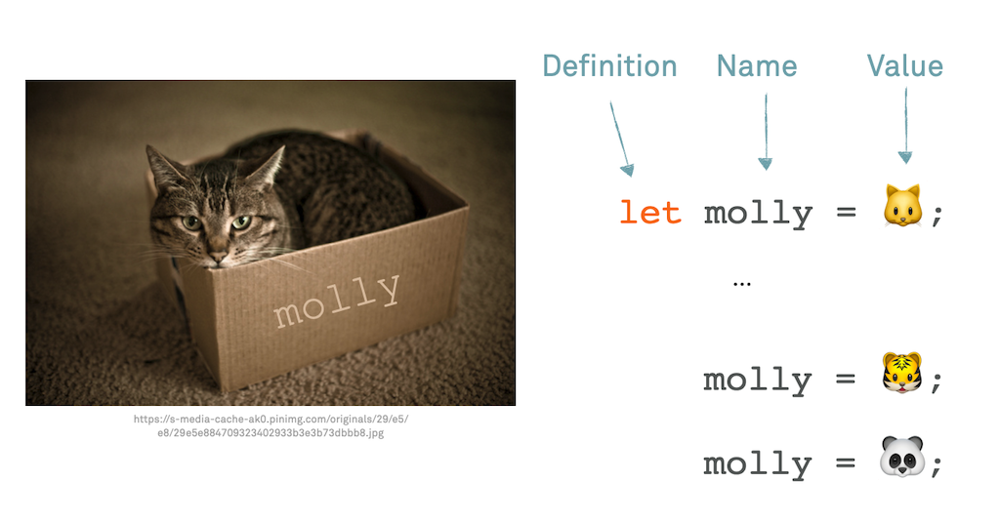
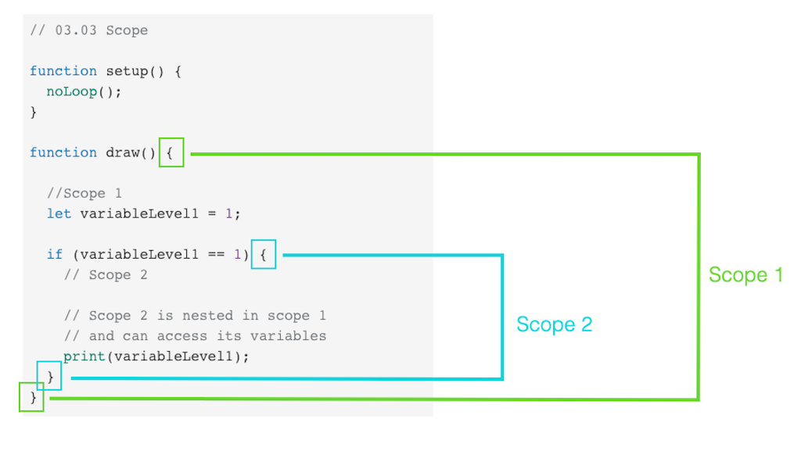
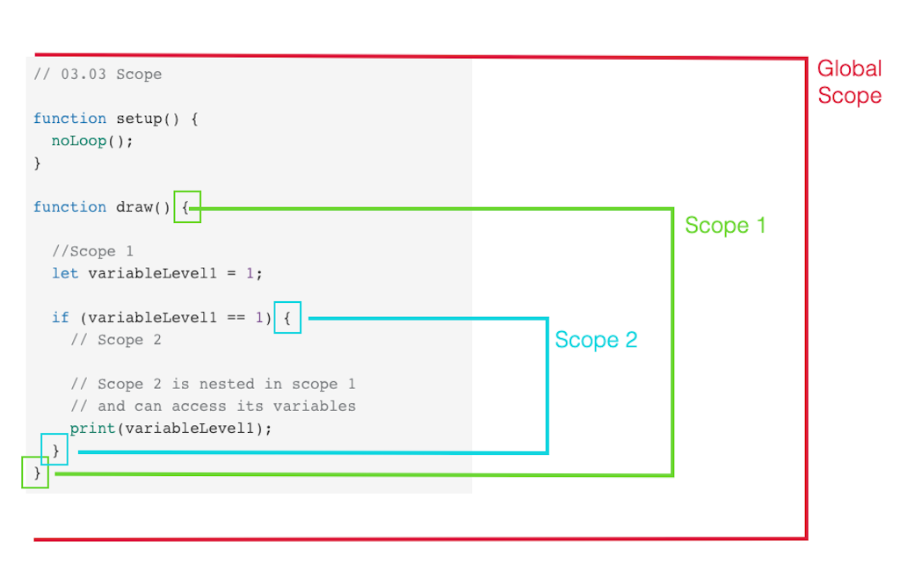
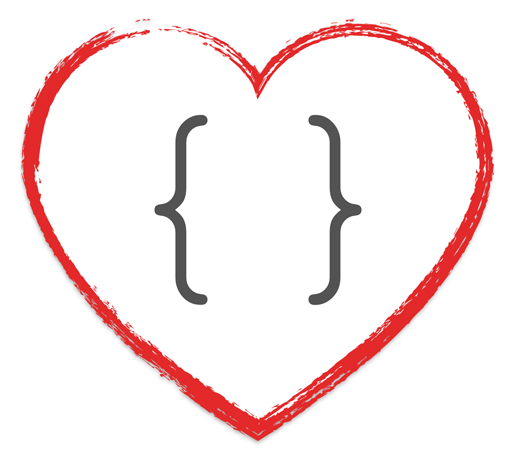
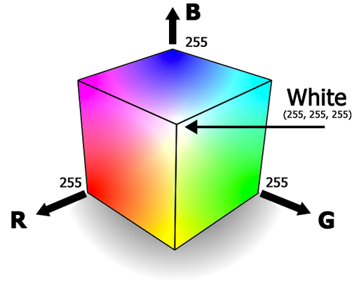
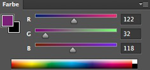
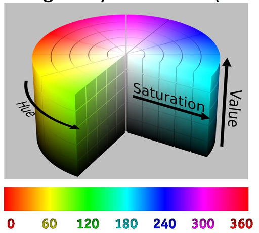
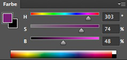
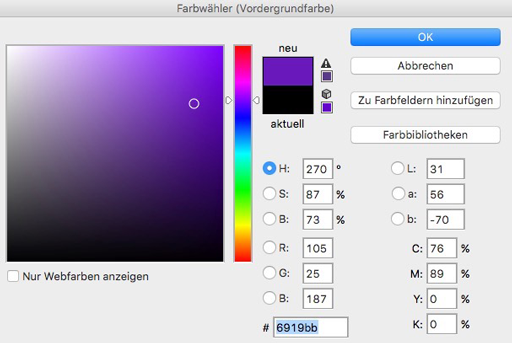

**Creative Coding - Summer School 2019**

Prof. Dr. Lena Gieseke | l.gieseke@filmuniversitaet.de | Film University Babelsberg *KONRAD WOLF*

---

# Script 05 - Variables

* [Script 05 - Variables](#script-05---variables)
    * [Today](#today)
    * [Learning Objectives](#learning-objectives)
    * [Assignment 02.02 Mouse Movement *Speed*](#assignment-0202-mouse-movement-speed)
    * [Variables](#variables)
        * [Initalization](#initalization)
    * [Variables](#variables-1)
        * [Naming Conventions](#naming-conventions)
        * [Data Types](#data-types)
        * [Data Types List](#data-types-list)
            * [String](#string)
            * [Number](#number)
            * [Boolean](#boolean)
            * [undefined](#undefined)
            * [print()](#print)
            * [Summary Data Types](#summary-data-types)
        * [Variable Scope](#variable-scope)
        * [Nesting Scopes](#nesting-scopes)
        * [Global Scope](#global-scope)
        * [Summary](#summary)
    * [Application - Animation](#application---animation)
        * [Change the Color of the Circle Automatically](#change-the-color-of-the-circle-automatically)
        * [Refinement: Smoothly Change the Color of the Circle Automatically](#refinement-smoothly-change-the-color-of-the-circle-automatically)
        * [Why Does the Color Stop Changing?](#why-does-the-color-stop-changing)
        * [How Can We Have the Color Loop Back And Forth?](#how-can-we-have-the-color-loop-back-and-forth)
    * [Operators](#operators)
        * [Comparison Operators](#comparison-operators)
            * [Arithmetic Operators](#arithmetic-operators)
            * [Logical Operators](#logical-operators)
    * [Nicer Colors](#nicer-colors)
    * [Summary](#summary-1)
    * [References](#references)

---

Today we are working with [cats in boxes](https://www.youtube.com/watch?v=TbiedguhyvM):

  
[[pinimg]](https://i.pinimg.com/originals/29/e5/e8/29e5e884709323402933b3e3b73dbbb8.jpg)


## Today

* Variables
    * Data Types
    * Scope
* Operators
* Animation


## Learning Objectives


With this session you 

* understand how to work with data, and
* understand what the scope of a variable is, and
* how animate certain properties, such as color and position.

## Assignment 02.02 Mouse Movement *Speed*

```js
function draw()
{
    ellipse(mouseX, mouseY, abs(mouseX - pmouseX) + abs(mouseY - pmouseY), 
                            abs(mouseX - pmouseX) + abs(mouseY - pmouseY));
}
```

*Can this be good?* 🤔

<!-- 

???
.task[ASK:]  

* What do you think might be the problem with this and can you think of a solution?

 -->

NOO! Such a long and repetitive statement is actually quite horrible, because it is

* tedious,
* error-prone,
* non-performant, and
* hard to read for humans.

*What could be a better approach here?*

Yes, we should compute the distance only once, save its value and reuse it for both, width an height of the ellipse command.

```js
// 03.01 A Variable
// https://www.openprocessing.org/sketch/1023094


function draw() {

    // Variable definition
    let speed = abs(mouseX - pmouseX) + abs(mouseX - pmouseX);
    // Usage of the variable
    ellipse(mouseX, mouseY, speed, speed);
}
```

<!-- 
---
template:inverse

## Variables

 -->


## Variables

Think back to the idea of understanding coding like creating a cooking recipe. In practice, a recipe only to make sense with the actual *ingredients* to cook with. Similarly, programming really only enfolds its full potential when working with data. You can think of the various forms of data such as a mouse click, text or numbers, as being the ingredients for programming.

Data can come in various forms, such as

* Inputs such as images, video, sound files or streams
* Inputs from user interaction, ranging from a key pressed to spoken words or hand gestures
* Data defined in the program such as constant values or a data table
* Data generated during the program such as formula computations

In programming, data is saved in *variables*. 

Imagine variables as boxes in which you can put stuff and that

* boxes can be moved around,
* boxes can be empty, and
* what is inside a box can be changed.

  


### Initalization

Variables must be specifically created with the `let` keyword and any name of your choosing.

```js
let speed;
```

Usually you give it an initial value directly when creating the variable:

```js
let speed = 10.5;
```

```js
//Pseudo code

let variablename = value;
```

With the single `=` you assign a value to a variable.

If you do not initialize the variable when you create it, its value is *undefined* until you assign a value to it. Using a variable with a undefined value can lead to unexpected behavior.

After you created a variable and give it a values, you can work with it:

```js
circle(50, 50, speed);
print(speed);
```

At all times you can change the value of a variable:

```js
speed = speed + 44.25;
```

## Variables

If you are trying to work with a variable that does not exists, p5 will throw an error:

```js
// 03.06 Variable Error
// https://www.openprocessing.org/sketch/1025053

function draw() {

    let sped = 10.5;

    circle(50, 50, speed);
    print(speed);
}
```

Error:

> ReferenceError: speed is not defined.  
> 🌸 p5.js says: There's an error due to "speed" not being defined...


### Naming Conventions

For programming, upper and lower case spelling matters!

```js
thisName != thisname
```

You mustn't use

* Umlaute, ß, or accents,
* names the p5 syntax is using, such as `let`, `function`,
* spaces and hyphen, or
* start with a number.

You should

* start with a small letter, and
* separate different words with camel case.

```js
thisNameIsAwesome
```

**Use sensible names!**

### Data Types

The computer keeps track of the *type of data* that is inside of the box. For different data types, memory is allocated differently (you don't need to worry about memory allocation though).

So, be aware that data has a *type*. E.g., the type of `speed` variable in the the above example is a *number*. The value you give a variable defines the type.

JavaScript is a loosely typed programming language. That means it is loose about data types 😊. That means that you can assign and re-assign values of all types to the same variable:

```js
let myVariable = 42;        // a number
myVariable     = 'hello';   // a string
myVariable     = true;      // a boolean
```

Just keep in the back of your head that this behavior makes JavaScript quite special. In most other programming language a variable can only accept values of the same type.




### Data Types List

There are in total nine types:

Six primitive data types, whic are the basic types checked by typeof operator:

| Data Type   | Description                                        | Example                          |
|-------------|----------------------------------------------------|----------------------------------|
| `String`    | represents textual data                            | `'hello'`, `"hello world!"` etc. |
| `Number`    | an integer or a floating-point number              | `3`, `3.234`, `3e-2` etc.        |
| `BigInt`    | an integer with arbitrary precision                | `900719925124740999n`, `1n` etc. |
| `Boolean`   | Any of two values: true or false                   | `true` and `false`               |
| `undefined` | a data type whose variable is not initialized      | `let a;`                         |
| `null`      | special keyword denoting a null value              | `let a = null;`                  |
| `Symbol`    | data type whose instances are unique and immutable | `let value = Symbol('hello');`   |
| `Object`    | key-value pairs of collection of data              | `let student = { };`             |

All data types except Object are called *primitive data types*, whereas Object is non-primitive. The non-primitive type Object can store collections of data, whereas primitive data type can only store a single data.

The only data types we care about are `String`, `Number`, `Boolean` and `undefined`.

[[3]](https://www.programiz.com/javascript/data-types)

#### String 

`String` is used to store text. In JavaScript, strings are surrounded by quotes:

* Single quotes: 'Hello'
* Double quotes: "Hello"
* (Backticks: `Hello`)

For example,

```js
//strings example
let firstName = 'Mickey';
let lastName = "Mouse";
let fullName = firstname + " " + lastname;
```

Single quotes and double quotes are practically the same and you can use either of them.

<!-- Backticks are generally used when you need to include variables or expressions into a string. This is done by wrapping variables or expressions with ${variable or expression} as shown above. -->

[[3]](https://www.programiz.com/javascript/data-types)

#### Number

`Number` represents integer (whole numbers) and floating numbers (decimals and exponentials). For example,

```js
let number1 = 3;
let number2 = 3.433;
```

[[3]](https://www.programiz.com/javascript/data-types)


#### Boolean

This data type represents the logical entity. `Boolean` represents one of two values: true or false. It is easier to think of it as a yes/no switch. For example,

```js
let classIsOngoing = true;
let nightTime = false;
```

[[3]](https://www.programiz.com/javascript/data-types)

#### undefined

The undefined data type represents value is not assigned. If a variable is declared but the value is not assigned, then the value of that variable will be undefined. For example,

```js
let name;
print(name); // returns undefined
```

*On a side note:* If you explicitly want a variable with no value, it is recommended to use `null` to assign 'unknown' or 'empty'.


[[3]](https://www.programiz.com/javascript/data-types)


#### print()

When working with a variable it is common practice while developing a program to print the value of a variable to know what is going on:

```js
let counter = 0;

// do stuff with counter

print(counter);
```


#### Summary Data Types

You can also check for the current type of a variable with the `typeof` command. It returns the type of that variable as a string.

```js
// 03.02 Data Types
// https://www.openprocessing.org/sketch/1024130

let wholeNumber = 10;
let floatingPointNumber = 10.25;
let truthValue = false;
let word = "Hello World";
let noValue;

print(typeof(wholeNumber));
print(typeof(floatingPointNumber));
print(typeof(truthValue));
print(typeof(word));
```


### Variable Scope

Variables have a *scope*. Scope refers to the area in the code where you can access the variable, meaning *where it exists*.

Scope areas are defined by curly brackets:

```js
{
    // Variable only exists inside the brackets
    let speed = 10.5;
}
```

Here it does not matter to what kind of code construct the curly brackets belong to. For all curly brackets scope applies in the same way.

```js
// Pseudo Code

function setup() {

    // Scope 1
}


if (name == 'ernie') {

    // Scope 2
} else {

    // Scope 3
}
```

What will happen in the following example?

```js
// 03.03 Scope
// https://www.openprocessing.org/sketch/1024143

function setup() {

    noLoop();
    let myVariable = 10;

    print('1. print: ' + myVariable); 

}

function draw() {

    // myVariable is out of scope here, 
    // meaning we can not access it
    print('2. print: ' + myVariable); 
}
```

### Nesting Scopes

Scopes can be nested and variables are visible from the inside of the nested brackets:

```js
// 03.03 Scope - Step 3


function setup() {
    noLoop();
}

function draw() {

    //Scope 1
    let variableLevel1 = 1;

    if (variableLevel1 == 1) {
        // Scope 2

        // Scope 2 is nested in scope 1
        // and can access its variables
        print(variableLevel1);
    }
}
```



Why does the following throw an error?

```js
// 03.03 Scope - Step 4

function setup() {
    noLoop();
}

function draw() {

    //Scope 1
    let variableLevel1 = 1;

    if (variableLevel1 == 1) {
        // Scope 2

        // Scope 2 is nested in scope 1
        // and can access its variables
        print('1. print: ' + variableLevel1);

        let variableLevel2 = 2;
    }

    // variableLevel2 is out of scope here, 
    // meaning we can not access it
    print('2. print: ' + variableLevel2); 
}
```

### Global Scope


There is a **global scope**. For this imagine one pair of `{}` around everything by default.




```js
// 03.03 Scope - Step 5

//Scope 0 - visible everywhere
let variableLevel0 = 1;

function setup() {
    noLoop();
}

function draw() {
    // Scope 1

    print('1. print: ' + variableLevel0);

    if (variableLevel0 == 1) {
        // Scope 2
        print('2. print: ' + variableLevel0)
    }

    print('3. print: ' + variableLevel0);
}
```


Global scope comes with many problems, e.g., it is difficult to keep track where the variable is changed in the code. However, for beginners it is perfectly fine to use global variables.

### Summary

* You have to define a variable with a name of your choice.
* You should initialize a variable with a value.
* **Variables only exists inside of the `{}`, where it was created**
* **If your variable behaves strangely, check its scope!**




## Application - Animation

### Change the Color of the Circle Automatically

Problem 1: Change the color of the circle  ✔️  
Problem 2: Automatically (✔️)

We already know how to change the color automatically in each frame. 

This is a nice first try but how do we create a smooth change of color?

```js
// https://www.openprocessing.org/sketch/1024171 - Step 2
// 03.05 - Animating the Color of the Circle - Step 02

function setup() {
    createCanvas(250, 250); 

    background(255);
    fill(255, 0, 0);
    noStroke();
}

function draw() {

    // For each draw() call,
    // we set the fill color to 
    // a new random color
    fill(random(255), 0, 0);
    ellipse(mouseX, mouseY, 20, 20);
}


function keyPressed() {
    if(key == 'c') {
        background(255);
    }
}

```

### Refinement: Smoothly Change the Color of the Circle Automatically

Idea: in each frame (meaning every time draw is called) count up a variable and use that variable for one color channel. Hence, the color should change smoothly by increasing its value one by one.

... but wait. Why does the color stop changing?

```js
// https://www.openprocessing.org/sketch/1024171 - Step 03
// 03.05 - Animating the Color of the Circle - Step 03


// Creation and initialization
// of a new variable
let colorRed = 0;

function setup() {
    createCanvas(250, 250); 

    background(255);
    fill(255, 0, 0);
    noStroke();
}

function draw() {

    // Using the colorRed variable
    // as value for the red channel
    fill(colorRed, 0, 0);
    ellipse(mouseX, mouseY, 20, 20);

    // Increasing the value
    // in each draw() call
    colorRed = colorRed + 1;
    // print(colorRed);
}


function keyPressed() {
    if(key == 'c') {
        background(255);
    }
}
```

### Why Does the Color Stop Changing?

We continuously increase the value for the `colorRed` variable and at some point its value is above 255. But there are only up 255 color values in the r,b,g system for one channel. Hence, every value above 255 will just clamped to 255. So when, e.g. `colorRed` is 500, the color looks like 255.

In order to change this "overflow", we need to check for the possible value range of a color and make sure that colorRed only gets values 0..255.

```js
// https://www.openprocessing.org/sketch/1024171
// 03.05 - Animating the Color of the Circle - Step 04

let colorRed = 0;

function setup() {
    createCanvas(250, 250); 

    background(255);
    fill(255, 0, 0);
    noStroke();
}

function draw() {

    fill(colorRed, 0, 0);
    ellipse(mouseX, mouseY, 20, 20);

    colorRed = colorRed + 1;
    // print(colorRed);

    // We check whether the value of
    // colorRed becomes larger than 255,
    // and if so we reset it back to zero.
    if(colorRed > 255){
        colorRed = 0;
    }
}

// Called if a key was 
// pressed
function keyPressed() {
    if(key == 'c') {
        background(255);
    }
}
```

### How Can We Have the Color Loop Back And Forth?

For making the color change loop, we want first that the color is increased by one (`colorRed = colorRed + 1;`) when it starts at zero, until it is at 255. When it reached 255, we want to "switch direction" and decrease the `colorRed` value (`colorRed = colorRed + 1;`) until it reached zero. Once it reached zero, we want to switch direction again and count up again, and so on and so on.

For that we can utilize a new `step` variable, which controls if we add or subtract one from our `colorRed` variable.


```js
// https://www.openprocessing.org/sketch/1024171
// 03.05 - Animating the Color of the Circle - Step 05

let colorRed = 0;

// New variable to add as
// step to colorRed
let step = 1;

function setup() {
    createCanvas(250, 250); 

    background(255);
    fill(255, 0, 0);
    noStroke();
}

function draw() {

    fill(colorRed, 0, 0);
    ellipse(mouseX, mouseY, 20, 20);

    // Adding the step variable
    // to colorRed instead of simply adding 1
    colorRed = colorRed + step;
    //print(colorRed);

    if(colorRed > 255){
        step = step * -1;
    }
}
```

Further explanation:

```js
// Pseudo Code

let colorRed = 0;
let step = 1;

...

colorRed = colorRed + step;

// This means as long as step is 1, we count colorRed up:
// 1 = 0 + 1 
// 2 = 1 + 1
// 3 = 2 + 1
// 4 = 3 + 1
// ...

// When colorRed becomes larger than 255 we 
// multiply step by -1 so that step becomes equal -1

if(colorRed > 255){
    step = step * -1;
}

// -1 = 1 * -1 -> step is now -1

// Now when we count up colorRed, we are actually doing a subtraction!

colorRed = colorRed + step;

// This means as long as step is -1, we count colorRed DOWN:
// 254 = 255 + (-1)  = 255 -1
// 253 = 254 + (-1)
// 252 = 253 + (-1)
// ...
```


But wait, what is going on, why does it remain black after a while? 

We also have to check for the value to become smaller zero.

For that we are using the `or` operator with `||`, which connects two conditions. This means one of the two conditions (condition 1 is `colorRed > 255` and condition 2 is `colorRed < 0`) needs to be true for the whole statement `condition 1 or condition 2` to be true.

```js
// https://www.openprocessing.org/sketch/1024171
// 03.05 - Animating the Color of the Circle - Step 06

let colorRed = 0;
let step = 1;

function setup() {
    createCanvas(250, 250); 

    background(255);
    fill(255, 0, 0);
    noStroke();
}

function draw() {

    fill(colorRed, 0, 0);
    ellipse(mouseX, mouseY, 20, 20);

    colorRed = colorRed + step;
    // print(colorRed);

    // We will execute the if code block if ether colorRed > 255
    // or colorRed < 255
    if(colorRed > 255 || colorRed < 0){

        step = step * -1;
    }
}
```


Done 🥳

Now, we have a nicely looping color change.


## Operators

For creating logic and values, variables are often used in combination with operators. We have already worked with the comparison operator:

```js
if(key == 'c')
{
    background(255);
}
```

end just now with the or operator `||`:

```js
if(colorRed > 255 || colorRed < 0){

        step = step * -1;
    }
```

In the following now an overview of all possible operators.

### Comparison Operators

| Comparison           | Operator |
|----------------------|----------|
| Is equal?            | `==`     |
| Is not equal?        | `!=`     |
| Is larger?           | `>`      |
| Is larger or equal?  | `>=`     |
| Is smaller?          | `<`      |
| Is smaller or equal? | `<=`     |


#### Arithmetic Operators

| Arithmetic               | Operator |
|--------------------------|----------|
| Addition                 | `+`      |
| Subtraction              | `-`      |
| Multiplication           | `*`      |
| Division                 | `/`      |
| Increment value with one | `++`     |
| Decrement value with one | `--`     |

```js
let value = 10;

value = value + 1; //now value is 11

// This is the same as the line above
value++; //now value is 12
```

```js
let value = 10;

value++; //now value is 11
value--; //now value is 10 again
```

If you want to work with the current value of the variable often this short cut is used:


```js
let num = 12;

num = num + 20; //now value is 32

// This is the same as the line above
num +=20; //now num is 52
```

```js
let num = 10;

num +=20; //now num is 30
num *=2
```

```js
let num = 10;

num +=20; //now num is 30
num *=2; //now num is 60
```


#### Logical Operators

Logical operators are used to combine statements.

| Logic  | Operator |
|--------|----------|
| and    | `&&`     |
| or     | `||`     |
| negate | `!`      |


```js
if(colorRed > 255 || colorRed < 0)
{
    step *= -1;
}
```

## Nicer Colors

How can we iterate through the whole color spectrum?

<!-- `
``js
// 03.06 - The Color Spectrum
// https://www.openprocessing.org/sketch/1024185

let colorRed = 0;
let colorGreen = 0;
let colorBlue = 0;

let step = 1;

function setup() {
    createCanvas(500, 500); 

    background(255);
    fill(255, 0, 0);
    noStroke();
}

function draw() {

    fill(colorRed, colorGreen, colorBlue);
    ellipse(mouseX, mouseY, 100, 100);

    colorRed = colorRed + step;
    colorGreen = colorGreen + step;
    colorBlue = colorBlue + step;

    if(colorRed > 255 || colorRed < 0){

        step = step * -1;
    }
} 
```
-->

The r, g, b color system is notoriously difficult to control visually. Thankfully, there are several **color systems** which are easier for humans to work with. p5 offers RGB and HSB.

### Color Systems

A color system is a numeric systems to represent color. There are many, many systems, optimized for specific use cases such as printing.

All of these systems are pretty much just different descriptions for the same color. The color space is the set of colors that a specific color system is able to describe.

In p5 we have access to two color systems:

* RGBA (default)
* HSB


#### RGB

* Additive color model
* Often one Byte (8 Bit) for each color
    * 0..255
* 16,7 Mio. (256 * 256 * 256 = 16 777 216) different colors describable


[medialooks](https://old.medialooks.com/mplatform/docs/CK%20Advanced.html)




#### HSB

HSB gives usually better control over the color and offers a more aesthetic color gradient. The color system's parameter are based on human perception.

* Hue
    * Position on color spectrum 0°..360°
* Saturation
    * “Amount of color”
    * Ratio color and grey, 0%..100%
* Brightness
    * Ratio color and black, 0%..100%
* 3,6 Mio. (360 * 101 * 101 = 3 672 360) different colors describable









In p5 you can set the color system to HSB with:

```js

//https://p5js.org/reference/#/p5/colorMode

colorMode(HSB);

// This sets the channel ranges to
// H: 0..360
// S: 0..100
// B: 0..100
```

That command should be placed before all other commands working with color, such as `background()` and `fill()`.  

By using the HSB color system instead of RGB, we can iterate through the hue channel and with that we only change the color. We keep the brightness and saturation as it. Hence, we are getting nicer, fully bright and saturated colors.

```js
// https://www.openprocessing.org/sketch/1024185
// 03.06 - The Color Spectrum - Step 2

let hue = 0;
let step = 1;

function setup() {
    createCanvas(500, 500);

    // Setting the color mode
    // to HSB
    colorMode(HSB);

    // Then we also need to
    // adjust the background values
    // to the hsb system
    background(0, 0, 100);
    noStroke();
}

function draw() {

    fill(hue, 100, 100);
    ellipse(mouseX, mouseY, 100, 100);

    hue = hue + step;

    if (hue > 360 || hue < 0) {

        step = step * -1;
    }

}

// Called if a key was 
// pressed
function keyPressed() {
    if (key == 'c') {
        background(255);
    }
}
```

*On a side note:*  

Another benefit of the hue channel is that the hue spectrum has at both ends the same color (0 = 359 = red). This means we could also just jump from 359 back to 0 and get rid of the step variable all together while still having a smooth transition. The simpler code is, the better!

```js
// https://www.openprocessing.org/sketch/1024185
// 03.06 - The Color Spectrum - Step 3

let hue = 0;

function setup() {
	createCanvas(500, 500);
	
	// Setting the color mode
	// to HSB
	colorMode(HSB);

	// Then we also need to
	// adjust the background values
	// to the hsb system
	background(0, 0, 100);
	noStroke();
}

function draw() {

	fill(hue, 100, 100);
	ellipse(mouseX, mouseY, 100, 100);

	// Short version
	// of hue = hue + 1;
	hue++;

	// Setting hue from 360
	// back to 0, which is the
	// same color
	if (hue > 359) {

		hue = 0;
	}

}

// Called if a key was 
// pressed
function keyPressed() {
	if (key == 'c') {
		background(255);
	}
}
```


## Summary

* We use variables to save and access data
    * `let hue = 0;`
    * Variables have a data type
    * Variables live inside `{}` and have a scope
* Operators
    * Arithmetic
        * `+`, `-`, `*`, `/`, `--`, `++`
    * Comparison
        * `>`, `>=`, `<`, `<=`, `==`, `!=`
    * Logical Operators
        * `&&`, `||`, `!`
* Two color systems available
    * RGBA
    * HSB
    * `colorMode(HSB);`

Use the [reference](https://p5js.org/reference/) 🚒


## References

[[1] C. Reas, B. Fry (2014): Interactivity. Processing: A Programming Handbook for Visual Designers and Artists. MIT Press.](https://www.processing.org/tutorials/interactivity/)  
[[2] MDN web docs - JavaScript data types and data structures](https://developer.mozilla.org/en-US/docs/Web/JavaScript/Data_structures)  
[[3] Programiz - JavaScript Data Types](https://www.programiz.com/javascript/data-types)  


---

The End

📦 🐱 🎨