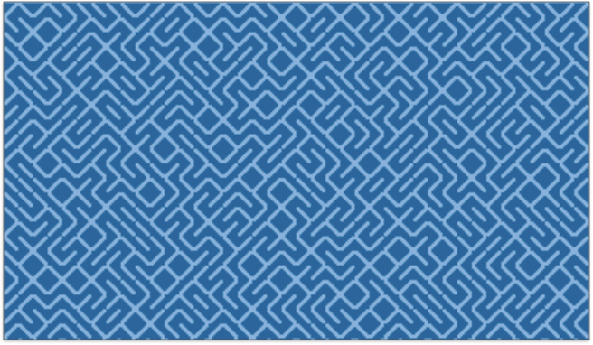
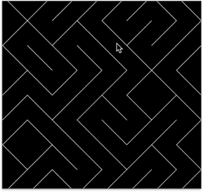
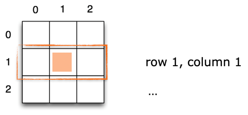
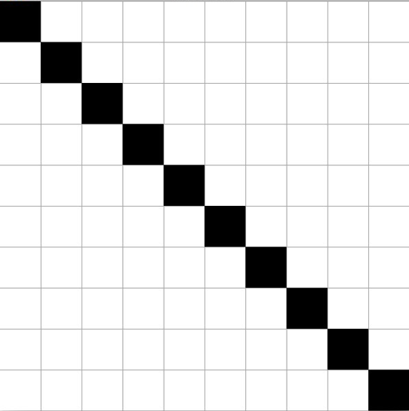
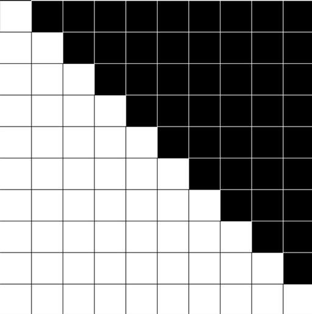
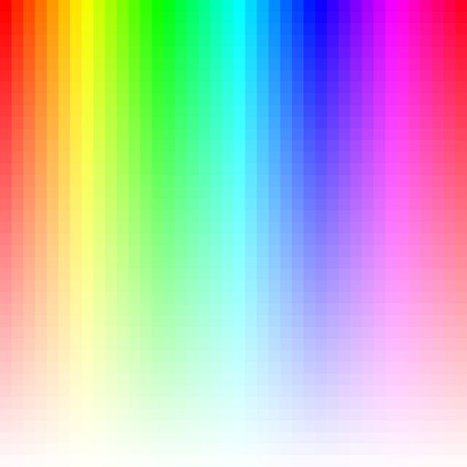

**Creative Coding - Summer School 2019**

Prof. Dr. Lena Gieseke | l.gieseke@filmuniversitaet.de | Film University Babelsberg *KONRAD WOLF*

---

# Script 06 - Loops

* [Script 06 - Loops](#script-06---loops)
            * [Spacing](#spacing)
            * [Probability](#probability)
    * [Today](#today)
    * [Learning Objectives](#learning-objectives)
    * [Looping](#looping)
    * [`while`-Loop](#while-loop)
    * [Loop Logic](#loop-logic)
    * [For-Loop](#for-loop)
    * [2D Loops](#2d-loops)
    * [A Grid](#a-grid)
    * [The 10 PRINT Example](#the-10-print-example)
    * [Further Grid Examples](#further-grid-examples)
        * [The Modulo Operator](#the-modulo-operator)
    * [Summary](#summary)

---



*What do we see? Can you find the underlying algorithm?*

Algorithm

* Go row by row
* Place a `/` or a `\` randomly


The original BASIC program for the Commodore 64:

```bash
10 PRINT CHR$(205.5+RND(1)); : GOTO 10
```
<!-- ??? BASIC had its own character indices (not ASCII) -->

Bash:

```bash
f="╱╲";while :;do print -n ${f[(RANDOM % 2) + 1]};done
```

<!-- 
???
.task[TASK:]  

* Show terminal version
 -->

* BASIC program from the 1980s
* Considered a phenomenon of creative coding through its simplicity and visual appeal
* There is a whole [book](http://10print.org/) dedicated to this line of code
* Representing the history of creative coding
* You can watch the author talk about his work on [youtube](https://www.youtube.com/watch?v=34CXQr5OLas)

*How could we modify the pattern? Which parameters do we have?*

#### Spacing

 

#### Probability

E.g. 90% probability for a backslash


As we are repeatedly placing a `/` or a `\` we need to learn how to repeat code for creating such a pattern. And that is coincidentally what you are going to learn in this script 😁.

## Today

* while Loops
* for-Loops
* 2D Loops
    * Filling the 2D canvas
* Grid-based Pattern

## Learning Objectives

With this session you 

* understand how to repeat code,
* know how to implement a `while` and a `for`-loop, 
* know how to implement a 2D `for`-loop, and
* understand how to create grid-based pattern.

## Looping

For repeating the same code multiple times, there are two types of loops, namely `while-` and `for-`loops.

Let's first have a look into `while`-loops.


## `while`-Loop

The while loop is closely related to the if-statement. However, the if-statement block is only executed once, if the condition is true. For a while-statement, its code block is executed as long as (*while*) a condition is true.

```js
// Pseudo code

while (condition)
{  
    statement;
}
```

You have to make sure that the condition becomes `false` at some point!!  

Otherwise you have created an **infinity loop** 🤬


```js
// https://www.openprocessing.org/sketch/1018352
// 05.01 While Loop

let counter = 0;    // Iteration counter
while (counter < 3) // Loop condition
{  
    print(“wow”);     // Loop activity

    counter += 1;       // Increase counter
}
print(“All done…”);
```

  
[[michaelkipp]](http://michaelkipp.de/processing/07%20schleifen.html)


```js
// https://www.openprocessing.org/sketch/1018355
// 05.02 Loop Inside Draw

...

function draw() {

    let counter = 0; // Iteration counter
    while (counter < 30) // Loop condition
    {
        ellipse(mouseX + random(30), mouseY + random(30), 2, 2);
        counter += 1; // Increase counter
    }
}

...

```

What is exactly happening here? What is repeated when?

* The `draw()` function is called by default 60 times per second.
    * For each `draw()` call, we execute the loop, hence we draw 30 ellipses 60 times per second.


Even though the while-loop works just fine with setting up a counter and increasing it manually, it is there is another way of creating loops which gives us more control and is less error prone.

Before we have a look into `for`-loops, let's review the general loop logic.

## Loop Logic

Independently from the specific syntax both loops follow the same logic and include the same components.

For repeating code you need to

* Create a variable (e.g. `i`) as iterator
    * Initialize the iterator with a start value
* Give a termination condition
* Increase the iterator in each loop
* Check for the termination condition

The last two points can also happen in reversed order (hence, first check the termination condition and then increase the iterator).

## For-Loop

The `for`-loop also executes a block of code the given number of times. It is used more often than the while loop because it gives you more control.

Let's first review the above loop logic in the `while`-loop syntax:

```js
let counter = 0;    // INITIALIZATION
while (counter < 3) // CONDITION
{ 
    // code
    counter += 1;   // STEP
}
```

Now, let's see how the logic is arranged in a within the `for`-loop syntax:

```js
// Pseudo Code

for(INITIALIZATION; CONDITION; STEP)
{
    // code
}
```

Here an example with the correct syntax:

```js
for(let i = 0; i < numberOfTimes; i++)
{

    // code

}
```

* You can chose any variable name as iterator
    * `i` as short for iterator is just typical
* You can chose any start value
    * Most times it will be `0` though
* You can chose any end value `numberOfTimes`
    * This can be a direct value or a variable
* `i++` is a shortcut for `i=i+1` and represents the step size, meaning how the value of the iterator changes from iteration to iteration
    * You can chose any step size you want, e.g. `i+=12`

Here, the same examples that we had before with a `while`-loop but with a `for`-loop:


```js
let counter = 0;
while (counter < 3)
{ 
    print(“wow”);
    counter += 1;
}
```

becomes:

```js
// https://www.openprocessing.org/sketch/1027707
// 05.03 For Loop

for(let i = 0; i < 3; i++){
    print(“wow”);
}
```

or with a different variable name:

```js
for(let counter = 0; counter < 3; counter++){
    print(“wow”);
}
```

The above follow the same logic as the while loop:

  
[[michaelkipp]](http://michaelkipp.de/processing/07%20schleifen.html)


```js
// https://www.openprocessing.org/sketch/1027703
// 05.04 The For-Loop Inside Draw

...

function draw() {

    // let counter = 0; // Iteration counter
    // while (counter < 30) // Loop condition
    // {
    //     ellipse(mouseX + random(30), mouseY + random(30), 2, 2);
    //     counter += 1; // Increase counter
    // }

    for (let i = 0; i < 30; i++) {
        ellipse(mouseX + random(30), mouseY + random(30), 2, 2);
    }
}

```


What is the scope of the iteration variable?  

The scope is **local** within the loop code block, meaning it is only visible inside the loop:

```js
// Pseudo Code

for(let i = 0; i < numberOfTimes; i++)
{

    // i only exists here

}
print(i); //gives an error
```


*How to create the following?*


## 2D Loops

In the following, we are not learning any new syntax but only apply what we have learned above.

As we are working on a 2D canvas in x and y, often times a 2D loop is used to fill a space, for example the canvas. You can imagine this as the filling of a grid.

This usually follows the logic of:

**For every row, look at every element…**

  
  
  
  
  

For implementing this, we **nest** two loop as follows

```js
// Pseudo Code

For every row {
    For every column {

    }
}
```


With the correct syntax, this looks as follows:

```js
// https://www.openprocessing.org/sketch/1027727
// 05.05 2D For-Loop

// Nested loop to run through the grid
for (let gridY = 0; gridY < numberRows; gridY++) {
    for (let gridX = 0; gridX < numberColumns; gridX++) {
        print("Row: " + gridY + " Column: " + gridX);
    }
}
```

But as said before, you normally used shorter names. The following is the same as this above but with different variable names. If the variables refer to x,y coordinate, you often also use x and y as iterator variable names:


```js
// https://www.openprocessing.org/sketch/1027727
// 05.05 2D For-Loop -  Step 2

// Nested loop to run through the grid
for (let y = 0; y < numberRows; y++) {
    for (let x = 0; x < numberColumns; x++) {
        print("Row: " + y + " Column: " + x);
    }
}
```

## A Grid

Now, we can, for example, draw a rect at each x,y coordinate within the 2D loop. What do we need to change in the following example first?

```js
// https://www.openprocessing.org/sketch/1027739
// 05.06 A Grid

let numberRows = 3;
let numberColumns = 4;

let rectSize = 50;

function setup() {
    createCanvas(1000, 1000);
    background(255);

    noLoop();
}

function draw() {

    // Nested loop to run through the grid
    for (let y = 0; y < numberRows; y++) {
        for (let x = 0; x < numberColumns; x++) {
            rect(x, y, rectSize, rectSize);
        }
    }
}
```

1. We need a higher number of rows and columns
    * For example, simply the width and height of the canvas
2. We need to take larger steps to draw fewer rectangles.
    * Here, we can use the size of the rectangle for the step size of the loop for creating a continuos grid.

```js
// https://www.openprocessing.org/sketch/1027739
// 05.06 A Grid - Step 3

let rectSize = 50;

function setup() {
    createCanvas(1000, 1000);
    background(255);

    noLoop();
}

function draw() {

    // Nested loop to run over
    // all pixels of the canvas
    // We are using the rectSize variable
    // to control the step size of the
    // loop
    for (let y = 0; y < height; y+=rectSize) {
        for (let x = 0; x < width; x+=rectSize) {
            rect(x, y, rectSize, rectSize);
        }
    }
}
```


Now, we can for example also draw ellipses along the grid.

```js
//https://www.openprocessing.org/sketch/1027739
// 05.06 A Grid - Step 4

let rectSize = 50;

function setup() {
    createCanvas(1000, 1000);
    background(255);

    noLoop();
    noFill();
}

function draw() {

    // Nested loop to run over
    // all pixels of the canvas
    // We are using the rectSize variable
    // to control the step size of the
    // loop
    for (let y = 0; y < height; y+=rectSize) {
        for (let x = 0; x < width; x+=rectSize) {

            rect(x, y, rectSize, rectSize);
            ellipse(x, y, rectSize, rectSize);
        }
    }
}
```

*Why is there this strange offset around the border?*

Because we are drawing the ellipses at the left upper corner (0,0) of each cell.

For that we add to the above example rectangle with `stepSize` as size to visualize the grid structure we are working with:

We could simply shift the drawing of the ellipse to the center of the current grid cell.

```js
// https://www.openprocessing.org/sketch/1027739
// 05.06 A Grid - Step 5

let rectSize = 50;

function setup() {
    createCanvas(1000, 1000);
    background(255);

    noLoop();
    noFill();
}

function draw() {

    // Nested loop to run over
    // all pixels of the canvas
    // We are using the rectSize variable
    // to control the step size of the
    // loop
    for (let y = 0; y < height; y+=rectSize) {
        for (let x = 0; x < width; x+=rectSize) {

            // rect(x, y, rectSize, rectSize);
            ellipse(x + rectSize*0.5, y + rectSize*0.5, rectSize, rectSize);
        }
    }
}
```

For making this more interesting, we could control the width and height of the ellipses with mouseX and mouseY. For that we need to map the possible value range of 0..1000 that mouseX and mouseY can have to a smaller range, e.g., 5..500 for having a reasonable sizes for the ellipse:

```js
// https://www.openprocessing.org/sketch/1027739
// 05.06 A Grid - Step 6

let rectSize = 50;

function setup() {
    createCanvas(1000, 1000);
    background(255);

    // For interaction don't forget
    // to turn on the loop again!
    //noLoop();
    noFill();
}

function draw() {

    // Clearing the background in each
    // draw call
    background(255);

    // Mapping the value range mouseX, and mouseY
    // can have to 5..500 with the map function
    // https://p5js.org/reference/#/p5/map
    let diameterX = map(mouseX, 0, width, 5, 250);
    let diameterY = map(mouseY, 0, height, 5, 250);

    // Nested loop to run over
    // all pixels of the canvas
    // We are using the rectSize variable
    // to control the step size of the
    // loop
    for (let y = 0; y < height; y+=rectSize) {
        for (let x = 0; x < width; x+=rectSize) {

            // rect(x, y, rectSize, rectSize);
            ellipse(x + rectSize*0.5, y + rectSize*0.5, diameterX, diameterY);
        }
    }
}
```

## The 10 PRINT Example

Remember this intro? Now we know how to implement the 10 PRINT example!

  
[[10print.org]](https://10print.org/)

We need to place randomly either a slash or backslash in each cell of our grid. In order to have a simple 50-50 decision maker, you can use the following:

```js
let probability = 0.5;

if (random(1) < probability) //all random numbers between 0..0.49
{
    //...
}
else //all random numbers between 0.5..0.99
{
    //...
}
```

Using simple line drawing for the slashes and styling the output:

```js
// https://www.openprocessing.org/sketch/1029077
// 05.07 10Print Pattern

let cellSize = 50;

// Threshold for which
// slash to draw
let probability = 0.5;


function setup() {
    createCanvas(1000, 1000);
    background(255);

    noLoop();
}

function draw() {

    // Nested loop to run over
    // all pixels of the canvas
    // We are using the rectSize variable
    // to control the step size of the
    // loop
    for (let y = 0; y < height; y += cellSize) {
        for (let x = 0; x < width; x += cellSize) {


            // Switch which "character" to draw
            // based on probability
            if (random(1) < probability) {

                line(x, y, x + cellSize, y + cellSize);

            } else {

                line(x, y + cellSize, x + cellSize, y);

            }
        }
    }
}
```

## Further Grid Examples

For a better understanding of the grid structure and also of operators, here a couple of examples.

*How do you need to control the fill command to create the following examples?*



```js
// https://www.openprocessing.org/sketch/1027766
// 05.02 Grid Examples - Step 2

let stepSize = 100;


function setup() {
    createCanvas(1000, 1000);
    background(100);

    noLoop();
    
    background(255);
    noFill();
}

function draw() {

    // Nested loop to run over
    // all pixels of the canvas
    for (let y = 0; y < height; y+=stepSize) {
        for (let x = 0; x < width; x+=stepSize) {


            fill(255);
            // Changing the fill color
            // only for the cells on the
            // diagonal
            if ( y == x)
            {
                    fill(0);
            }

            rect(x, y, stepSize, stepSize);
        }
    }
}
```



```js
// https://www.openprocessing.org/sketch/1027766
// 05.02 Grid Examples - Step 3

...

stroke(0);
fill(255);

if (x > y) {
    stroke(255);
    fill(0);
}

...
```


The overall logic to create a checkerboard is to fill every other cell black and to shift that every other row. 

You could also say that in the even rows (meaning the 0., 2., 4. row...), the even columns (meaning the 0., 2., 4. column...) should be black, and in the uneven rows, the uneven cells should be black.

You can identify even numbers with the modulo operator.

### The Modulo Operator

The [modulo](https://www.computerhope.com/jargon/m/modulo.htm) operator returns for a division with a whole number the rest of that division:

```js
// Pseudo Code

5 / 2 is 2 (the quotient) with rest 1
7 / 5 is 1 with rest 2

x / y is quotient q with rest r
x = q * y + r
```

This comes in handy when testing for even numbers:

```js
let number = 7;

if (number % 2 == 0) 
{
    print("even");
}
```

In our example, we can not work directly with the pixel coordinates, as by adding an even `stepSize` for the grid, we only have even pixel coordinates, such as 0, 100, 200,... We need to divide the coordinates by `stepSize` to get the indices of the cells, with which we then want to do the modulo operation. Hence coloring a checkerboard can be done as follows:

```js
// https://www.openprocessing.org/sketch/1027766
// 05.02 Grid Examples - Step 4

function draw() {

    // Nested loop to run over
    // all pixels of the canvas
    for (let y = 0; y < height; y += stepSize) {
        for (let x = 0; x < width; x += stepSize) {

            fill(255);

            // We need to devide by stepSize
            // to get the indices
            let row = y / stepSize;
            let column = x / stepSize;


            if ((row % 2 == 0) && (column % 2 == 0)) {
                fill(0);
            } 
            else if ((row % 2 != 0) && (column % 2 != 0)) {
                fill(0);
            }

            rect(x, y, stepSize, stepSize);
        }
    }
}
```

The following is a shorter versions of the above logic. It is left to the interested reader to figure it out:

```js
// https://www.openprocessing.org/sketch/1027766
// 05.02 Grid Examples - Step 5

function draw() {

    // Nested loop to run over
    // all pixels of the canvas
    for (let y = 0; y < height; y += stepSize) {
        for (let x = 0; x < width; x += stepSize) {

            fill(255);

            // We need to devide by stepSize
            // to get the indices
            let row = y / stepSize;
            let column = x / stepSize;


            if ((row + column) % 2 == 0) {
                fill(0);
            } 

            rect(x, y, stepSize, stepSize);
        }
    }
}

```

You could also utilize the grid logic for a tile-based coloring of the canvas in HSB mode, such as in the following example. Once again, it is left to the interested reader to figure it out. For that keep in mind that you can set the ranges of the [HSB](https://p5js.org/reference/#/p5/colorMode) channels to whatever ranges you want:



```js
// https://www.openprocessing.org/sketch/1027766
// 05.02 Grid Examples - Step 6

let stepSize = 25;

function setup() {
    createCanvas(1000, 1000);

    noStroke();
    noLoop();

    colorMode(HSB, width, height, 100);
}

function draw() {

    // Nested loop to run over
    // all pixels of the canvas
    for (let y = 0; y < height; y += stepSize) {
        for (let x = 0; x < width; x += stepSize) {

            fill(x, height - y, 100);
            rect(x, y, stepSize, stepSize);
        }
    }
}
```


## Summary

* Loops

```js
while(i < numberOfTimes)…
```

```js
for(int i = 0; i < numberOfTimes; i++)…
```

* 2D Loop
    * *For every row look at every element…*

```js
for (let y = 0; y < numberRows; y++)
{
    for (let x = 0; x < numberColumns; x++)
    {
        print("Row: " + y + " Column: " + x);
    }
}
```

Use the [reference](https://p5js.org/reference/) 🚒

---

The End

🎨 🎡 🔗 
