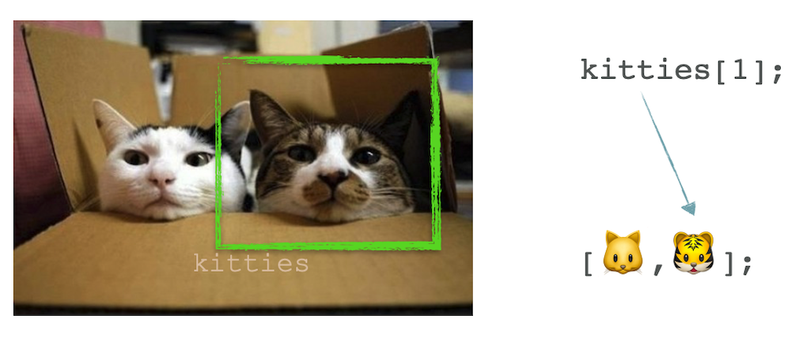

**Creative Coding - Summer School 2019**

Prof. Dr. Lena Gieseke | l.gieseke@filmuniversitaet.de | Film University Babelsberg *KONRAD WOLF*

---

# Script 07 - Arrays

* [Script 07 - Arrays](#script-07---arrays)
    * [Today](#today)
    * [Learning Objectives](#learning-objectives)
    * [More Than One Circle](#more-than-one-circle)
        * [Loops?!](#loops)
        * [Arrays to The Rescue! 🚨](#arrays-to-the-rescue-)
    * [Array](#array)
        * [Array Access](#array-access)
    * [Looping Over All Array Elements](#looping-over-all-array-elements)
        * [Properties](#properties)
        * [`for..of`](#forof)
    * [Changing Values](#changing-values)
        * [Push and Pop](#push-and-pop)
        * [Splice](#splice)
    * [Example Confetti](#example-confetti)
    * [2D Arrays](#2d-arrays)
    * [Summary](#summary)

---

This is one last thing we have to do with ellipses, before we move on for good (I promise!)... confetti!


## Today

* Arrays

## Learning Objectives

With this script you

* understand the logic behind arrays, and
* know how to use them.

## More Than One Circle 

So far we have only worked with one circle at a time. But how can we have more than one? Maybe even thousands of circles?

Well, we could copy all code as many times as the number of ellipses we want.

→ [OpenProcessing 07.01 - More Than One Circle - Step 1](https://www.openprocessing.org/sketch/1034502)

This can’t be right… Remember, whenever you are copying the same code multiple times, you should think of a better solution.

### Loops?!

Loops, e.g. `while`, let us repeat commands **multiple** times.

→ [OpenProcessing 07.01 - More Than One Circle - Step 2](https://www.openprocessing.org/sketch/1034502)
→ [OpenProcessing 07.01 - More Than One Circle - Step 3](https://www.openprocessing.org/sketch/1034502)

Not what we want. We need a different approach for defining individual characteristics per circle and saving them...


### Arrays to The Rescue! 🚨

Arrays let us save multiple elements into **one** variable. That makes it easy to work with many, many values at the same time, while still saving for each element a different value.

## Array

Let's have a look at this toy example: we want to draw rectangles with different width. For that, we could used the following code:

```js
// https://www.openprocessing.org/sketch/1034503
// 07.02 - Arrays

let width0 = 500;
let width1 = 610;
let width2 = 830;
let width3 = 690;
let width4 = 710;
let width5 = 500;
let width6 = 290;
let width7 = 310;
let width8 = 170;
let width9 = 390;

function setup() {
    createCanvas(1000, 1000);
    background(200);
}

function draw() {
    fill(100);
    rect(0, 0, width0, 80);
    rect(0, 100, width1, 80);
    rect(0, 200, width2, 80);
    rect(0, 300, width3, 80);
    rect(0, 400, width4, 80);
    rect(0, 500, width5, 80);
    rect(0, 600, width6, 80);
    rect(0, 700, width7, 80);
    rect(0, 800, width8, 80);
    rect(0, 900, width9, 80);
}
```

Now, we are using an array to store the width values and with that we make the code more compact:

```js
// https://www.openprocessing.org/sketch/1034503
// 07.02 - Arrays - Step 2

let widths = [500, 610, 830, 690, 710, 500, 290, 310, 170, 390];

function setup() {
    createCanvas(1000, 1000);
    background(200);
}

function draw() {
    fill(0);
    rect(0, 0, widths[0], 80);
    rect(0, 100, widths[1], 80);
    rect(0, 200, widths[2], 80);
    rect(0, 300, widths[3], 80);
    rect(0, 400, widths[4], 80);
    rect(0, 500, widths[5], 80);
    rect(0, 600, widths[6], 80);
    rect(0, 700, widths[7], 80);
    rect(0, 800, widths[8], 80);
    rect(0, 900, widths[9], 80);
}
```

Conceptually, you can imagine an array as follows. While a "normal" variable looks like:

 [[pinimg]](https://s-media-cache-ak0.pinimg.com/originals/29/e5/e8/29e5e884709323402933b3e3b73dbbb8.jpg)

```js
let molly = 🐱;
```

Then an array can be described as:

 [[kittentoob]](http://kittentoob.com/wp-content/uploads/2012/04/cat-pics31.jpg)

```js
let kitties = [🐱,🐯];
```

An array is defined by `[]` and is an ordered collection of values. Inside of an array, we can have a 1st, a 2nd, a 3rd element and so on. An array can store elements of any type.

```js
let widths = [500, 610, 830, 690, 710, 500, 290, 310, 170, 390];
let emptyArr = [];
let fruits = ["Apple", "Orange", "Plum"];
// mix of values
let mixed = [ 'Apple', 2, true, 'hehe'];
```

### Array Access

A specific element in the array is accessed over an index inside of the `[]`. **Indices start at 0!**





```js

let widths = [500, 610, 830, 690, 710, 500, 290, 310, 170, 390];

//...

function draw() {
    fill(0);
    rect(0, 0, widths[0], 80);
    rect(0, 100, widths[1], 80);
    rect(0, 200, widths[2], 80);
    rect(0, 300, widths[3], 80);
    rect(0, 400, widths[4], 80);
    rect(0, 500, widths[5], 80);
    rect(0, 600, widths[6], 80);
    rect(0, 700, widths[7], 80);
    rect(0, 800, widths[8], 80);
    rect(0, 900, widths[9], 80);
```

## Looping Over All Array Elements

For looping over all elements in an arrays we need to know how many element there are in the array. This can be given by a variable that we have defined or when we have an already filled array, we can use the `length` property of an array.  

### Properties

A property of something is accessed with the `.` notation as `object.property` (there are no parenthese). In this case we want to access the length of a array, hence the syntax is

```js
myArray.length
```

```js
let fruits = ["Apple", "Orange", "Plum"];
print(fruits.length) // 3
```

Which properties an object, e.g. an array, has, depends on the object type. An array, for example only has the property `length`. 


```js
// https://www.openprocessing.org/sketch/1034503
// 07.02 - Arrays - Step 3

let widths = [
    500, 610, 830, 690, 710, 500, 290, 310, 170, 390
];

function setup() {
    createCanvas(1000, 1000);
    background(200);
}

function draw() {
    fill(0);

    for (let i = 0; i < widths.length; i++) {
        rect(0, i * 100, widths[i], 80);
    }
}
```

If you access an array element, which you haven't assigned a value to, you will get `undfined` as value.

```js
// https://www.openprocessing.org/sketch/1034503
// 07.02 - Arrays Step 4

let widths = [500, 610, 830, 690, 710, 500, 290, 310, 170, 390];

function setup() {
    createCanvas(1000, 1000);
    background(200);

    // There is no value for
    // the element with the index 20
    print(widths[20]); // undefined
}

function draw() {}
```


### `for..of`

If we don't need the specific index of the iteration, we can also use this special `for..of` loop syntax for arrays:

```js
let fruits = ["Apple", "Orange", "Plum"];

// Special loop to iterate over array elements
for (let f of fruits) 
{
    print(f);
}

// The above is the same as
for (let i = 0; i < fruits.length; i++) 
{
    print(fruits[i]);
}
```

## Changing Values

The same way that you initialize an array with values with th `=` operator, you can change values inside of an array:

```js
let fruits = ["Apple", "Orange", "Plum"];

// Changing a specific value inside of the array
fruits[2] = "Strawberry";

print(fruits); // ["Apple", "Orange", "Strawberry"];
```

Keep in mind that you can access a value to any index of the array you want. JavaScript will not warn you, if it is not currently assigned a value. It will automatically set all values between the accessed new index and existing values inside of the array with `undefined` element.

For example:

```js
let fruits = ["Apple", "Orange", "Plum"];

// Changing a value inside of the array
// with an index that has no value yet
fruits[10] = "Strawberry";

print(fruits); // ["Apple", "Orange", "Plum", undefined, undefined, undefined, undefined, undefined, undefined, undefined, "Strawberry"]
```

A safer approach to changing values inside of an array are `push` and `pop`. Push for example makes sure that you add an element at the end of the array and that there are no `undefined` elements in between.

### Push and Pop

There are two special functions for working with arrays, `push` and `pop`. Push adds to the end of an array a new element, `pop` remove the last element of an array. These methods change the array itself and kind of "belong" to the array, similar to how the property `length` "belongs" to the array. Hence the functions push and pop are also directly attached to the array with the `.` notation and parenthese (because they are functions).

```js
myarray.push(element)
myarray.pop()
```

```js
// https://www.openprocessing.org/sketch/1034520
// 07.03 Push and Pop
let fruits = ["Apple", "Orange", "Plum"];

fruits.push("Banana");

print(fruits); // ["Apple", "Orange", "Plum", "Banana"];

fruits.pop();

print(fruits); // ["Apple", "Orange", "Plum"];
```

### Splice

If you want to, for example, remove an element at a specific index you have to use the `splice` method. The splice method adds/removes items to/from an array, and returns the removed item(s). The `splice` function also belongs to an array and is attached to it with a `.`. The syntax is

```
array.splice(index, howmany, item1, ....., itemX)
```

* `index`: Required. An integer that specifies at what position to add/remove items, Use negative values to specify the position from the end of the array
* `howmany`: Optional. The number of items to be removed. If set to 0, no items will be removed
* `item1, ..., itemX`: Optional. The new item(s) to be added to the array

Using the function to remove an element by index looks as follows:

```js
let fruits = ["Apple", "Orange", "Plum", "Strawberry"];

let indexToRemove = 2;

fruits.splice(indexToRemove, 1);

print(fruits); // ["Apple", "Orange", "Strawberry"]
```


## Example Confetti

Now, let's convert our base example into confetti.

→ [OpenProcessing 07.04 - Confetti - Steps 1-6](https://www.openprocessing.org/sketch/1034522)


## 2D Arrays

As with loops, you can also nest arrays, if needed. When working with 2D coordinates, a 2D array might be helpful. 

But often times 2D arrays just over-complicate you data structure. So, think about it carefully if you really need a nester array or if you are not complicating things unnecessarily. Also, with 2D arrays you have to think really hard, which dimension represents what.  

In the example below, we fill the grid 2D array with our familiar "for each row, iterate over all columns"-logic but then later, we need to access the array elements with `grid[y][x]`. Alternativly, we could have setup the array with a "for each column, iterate over all rows"-logic and then could have accessed the 2D array with `grid[x][y]`, which might feel more natural to us, as we are used to `x,y`-coordinates. It is up to you to decide, how you want to set up your data structure.


```js
// 07.05 2D Array

let grid = []; // In Javascript you can only initalize a 1D array.
let rows = 6;
let cols = 4;

let cellH = 0;
let cellW = 0;

function setup() {
    createCanvas(500, 500);
    background(100);
    noLoop();

    // Computing the cell size based
    // on the given number of rows and columns
    // in order to fill the canvas
    cellH = height / rows;
    cellW = width / cols;

    // Iterate over rows
    for (let y = 0; y < rows; y++) {

     grid.push([]); // Add an array for each row

    // Iterate over columns
     for (let x = 0; x < cols; x++) {

        grid[y].push(round(random(255))); // Push values per column
     }
        // print(grid[y]);
   }
    print(grid);
}

function draw() {
    // // Two nested loops allow us to visit every spot in a 2D array.
    // // For every row y, visit every column x.
    for (let y = 0; y < rows; y++) {
        for (let x = 0; x < cols; x++) {

            // In our array, the rows are represented by
            // the outer array, hence we must use the row
            // index for the first index of the array
            fill(grid[y][x]);

            rect(x*cellW, y*cellH, cellW, cellH);
        }
    }
}

```


## Summary

With arrays we can save multiple values in one variable.

```js
let myArray = [2, 4, 6, 8, 'done']
```

Arrays are accessed with an index, starting at `0`.

```js
print(myArray[2]) // 6
```

You can use loops to access all elements of an array.

```js
for (let i = 0; i < myArray.length; i++) {
    print('Element', i, ': ', myArray[i]);
}

//or

for (let element of myArray) {
    print(element);
}
```

Use the [reference](https://p5js.org/reference/) 🚒

---

The End

👩🏽‍🤝‍👨🏼  👩‍👧‍👦  👨‍👨‍👧‍👧 