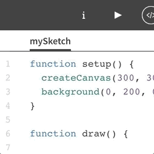

**Introduction to Coding**

Prof. Dr. Lena Gieseke | l.gieseke@filmuniversitaet.de | Film University Babelsberg *KONRAD WOLF*

Phil Clausen | phil.clausen@filmuniversitaet.de | Film University Babelsberg *KONRAD WOLF*

Winter Term 20/21

---

# Script 08 - Functions

- [Script 08 - Functions](#script-08---functions)
  - [Learning Objectives](#learning-objectives)
  - [Functions](#functions)
    - [Parameters](#parameters)
    - [Return values](#return-values)
    - [Why Should We Care?](#why-should-we-care)
  - [Files/Tabs](#filestabs)
  - [Summary](#summary)

---


## Learning Objectives

With this script you

* understand how to structure your code more wisely, and
* know how to define your own functions.


## Functions

So far most of our code was written directly inside of `setup()` and `draw()`. But as our code will get more and more complex, we need to think about how to structure it more wisely. One important step to do so is to write our own functions to encapsulate complicated logics into single function calls.

In [session 2](https://github.com/ctechfilmuniversity/lecture_introduction_to_coding/blob/master/02_scripts/itc_ws2021_04_flow_script.md) you already learnt the basics of functions:

To define a function you need the keyword function followed by a `functionname` (given or of your choice), followed by `()`, followed by `{...}`. What a function does is enclosed in the curly brackets.

```
function functionname() {
    // Code that is executed when we call the function
}
```

After we defined it we can then call the function:

```
function draw() {
  functionname();
}
```

Note that what you learnt about [variable scopes](https://github.com/ctechfilmuniversity/lecture_introduction_to_coding/blob/master/02_scripts/itc_ws2021_05_variables_script.md#variable-scope) also applies to functions: you can only call them at places where they are accessible from.


### Parameters

In all our examples we were calling functions which are defined inside the p5 library like this:

```
line(10, 10, 50, 50);
```

```
// Somewhere inside of the p5 library
// is the function definition 

function line(x1, y1, x2, y2) {
    beginShape();
    vertex(x1, y1);
    vertex(x2, y2);
    endShape();
}
```

And exactly like that we can also define our own functions with our input parameters:

```
function functionname(parameter1, parameter2, parameter3) {
  // Code that is executed when we call the function
}
```

When we call this function we then hand in the values or variables we want to use as `parameter1`, `parameter2` and `parameter3` as the arguments.

```
function draw() {
  let someValue = 1.5;
  functionname(100, 'whatever', someValue);
}
```

### Return values

Now we learnt how to pass values into functions. But what if we want the function to give a value back to us? Next to tasks such as "draw something" there can be tasks that result in a value with which we want to continue to work with.

The random command for example works like this:

```javascript
random(10, 100); // returns a value between 10 and 100
```

To write our own functions with return values we use the keyword `return` at the end of the function definition and the value behind it will be returned when we call it:

```
function calculateSquare(x) {
  return x * x;
}

function draw() {
  let result = calculateSquare(4); // returns 16
  print(result); // prints '16' to the console
}
```

### Why Should We Care?

Why should we define our own functions instead of just writing everything into setup() and draw()? It makes our code **modular** and **reusable**. Take a look at [this example.](https://www.openprocessing.org/sketch/1042127)


## Files/Tabs

To make our code even more modular and tidy it can be helpful to structure it in different files.

Think about the small jumping game from the assignment. The code would quickly become hard to read when we would put all code related to the player, the coin and the enemy into the same file.

In the p5 editor of OpenProcessing files are represented as tabs. To create a new tab click at the plus symbol next to the default tab "mySketch". Double click on the now created "tab2" and give it a more meaningful name.



Note: Tabs have no impact on variable scopes. A global variable stays a global variable and is accessible everywhere, even when its created in an other tab.


## Summary

- Functions have a name, optional parameters and an optional return value.

```
function addTen(float parameter1) 
{
	return (parameter1 + 10);
}
```

- Functions are called like all the commands we already know

```
let newValue = addTen(21);  //newValue is now 31
```

- Use them to encapsulate parts of your code, making it **modular** and **reusable**
- Use files/tabs to structure your code


Use the [reference](https://p5js.org/reference/) 🚒

---

The End

🌼 🌺 🌸