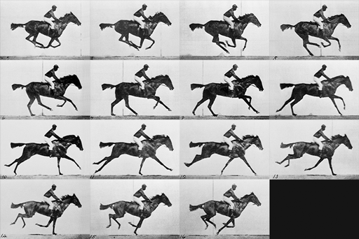
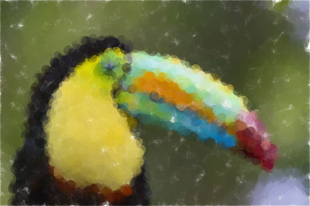
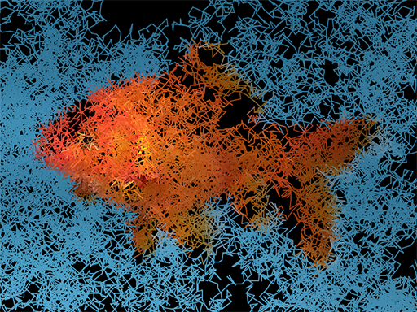
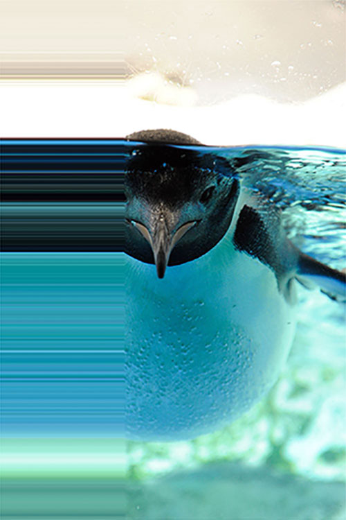
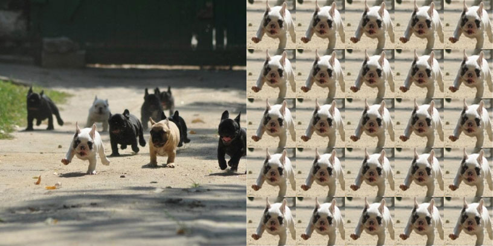

**Introduction to Coding**

Prof. Dr. Lena Gieseke | l.gieseke@filmuniversitaet.de | Film University Babelsberg *KONRAD WOLF*

Phil Clausen | phil.clausen@filmuniversitaet.de | Film University Babelsberg *KONRAD WOLF*

Winter Term 20/21

---

# Script 09 - Images

- [Script 09 - Images](#script-09---images)
  - [Learning Objectives](#learning-objectives)
  - [Images](#images)
    - [Loading And Displaying Images](#loading-and-displaying-images)
    - [Image Animations](#image-animations)
    - [Modifying the Size](#modifying-the-size)
    - [Modifying the Image Data](#modifying-the-image-data)
    - [Reading Pixel Data](#reading-pixel-data)
    - [Setting Pixel Data](#setting-pixel-data)
    - [Example - Pointillism](#example---pointillism)
    - [Example - Brownian Motion Lines](#example---brownian-motion-lines)
    - [Example - Stretching](#example---stretching)
    - [Example - Tiling](#example---tiling)
  - [Summary](#summary)

---


## Learning Objectives

With this script you

* know how to work with images,
* understand the concept of image animations, and
* understand how to manipulate images.


## Images

Now it's finally time to exchange our beloved ellipses with images.


### Loading And Displaying Images

Have a look at [this tutorial](https://www.openprocessing.org/sketch/1042197) on how to load and display images in p5.


### Image Animations

Images can be animated [in the same way as regular shapes.](https://www.openprocessing.org/sketch/1042241)

Another way of bringing images to live is to use a series of still images and display them in a fast sequence. This technique was "invented" in 1872 by Eadweard Muybridge. He was commissioned to prove whether a horse lifted all four legs off the ground at once when it ran. To do so, he set up a series of cameras along a track and took pictures in quick succession as a horse ran by. This process allowed him to capture 16 pictures of the horse's run. In one of the pictures, the horse did indeed have all four legs off the ground.



Muybridge later repeated the experiment and placed each photo onto a device that could project the photos in rapid succession to give the illusion of the horse running, creating the first movie projector!

[Let's rebuild Muybridge's animation in p5.](https://www.openprocessing.org/sketch/1042250)


### Modifying the Size

To resize an image to a new width `w` and height `h`, use `resize(w, h)`.

To make the image scale proportionally, use 0 as the value for the width or height parameter.

```js
let img;
img = loadImage('panda.jpg');

img.resize(200, 0); // Scales the image to a width of 200px, keeping its original proportions
```

[Tutorial](https://www.openprocessing.org/sketch/1052024)


### Modifying the Image Data

Images can be tinted to specified colors or made transparent by using the `tint()` command.

```js
tint(v1, v2, v3, [alpha]);
```

Depending on the color mode (RGB or HSB) `v1`, `v2` and `v3` are values for red, green and blue or hue, saturation, brightness.

`tint()` can also be used for making the image transparent. To apply transparency to an image without affecting its color, use white as the tint color and specify an alpha value, from no transparency 0 to full transparency 255 in the default alpha range.

```js
tint(255, 128); // The image is 50% transparent
```

Use `noTint()` to remove the current fill value for displaying images and revert to displaying images with their original hues.

[Tutorial](https://www.openprocessing.org/sketch/1052031)


### Reading Pixel Data

`get(x, y)` returns the color of the image at the specific pixel at the position x, y.

With the optional parameters w and h you can return a cutout of the image.

```js
get(x, y, w, h);
```

Be careful: You have to consider a possible offset of the image on the canvas, because `get()` always relates to positions within the image.

[Tutorial](https://www.openprocessing.org/sketch/1052077)


### Setting Pixel Data

`set(x, y, color)` sets the color of the pixel with the coordinate x, y.

Exactly like `get()`, `set()` also relates to the position within the image, so remember to consider a possible offset of the image on the canvas.

Before we are able to set pixel data, we need to load the pixel data with `loadPixels()`. After manipulating update the images pixel data with `updatePixels()` to see the effect.

```js
let img;
img = loadImage('panda.jpg');

let pixelColor = color(255, 0, 0); // Define pixelColor as a red color value

img.loadPixels(); // Load the pixel data of the image
img.set(100, 200, pixelColor); // Set the pixel at coordinate 100, 200 to pixelColor
img.updatePixels(); // Update the pixel data of the image
```

[Tutorial](https://www.openprocessing.org/sketch/1052082)


### Example - Pointillism



[Tutorial](https://www.openprocessing.org/sketch/1052091)


### Example - Brownian Motion Lines



[Tutorial](https://www.openprocessing.org/sketch/1052479)


### Example - Stretching



[Tutorial](https://www.openprocessing.org/sketch/1052516)


### Example - Tiling



[Tutorial](https://www.openprocessing.org/sketch/1052576)


## Summary

- Use the `preload()` function to make sure your image files are fully loaded before working with them

```
let img;

function preload() {
	img = loadImage("myImage.jpg");
}
```

- By default images have their upper-left corner as reference point (`imageMode(CORNER)`), which you can change by calling

```
imageMode(CENTER);
```

- Animate images e.g. by changing their position like any other shape
- Store images in arrays and display them sequentially to animate image series


- Use `get(x, y)` and `set(x, y, color)` to return or set the color of the image at a specific pixel


Use the [reference](https://p5js.org/reference/) 🚒

---

The End

🏇 📷 🖼️