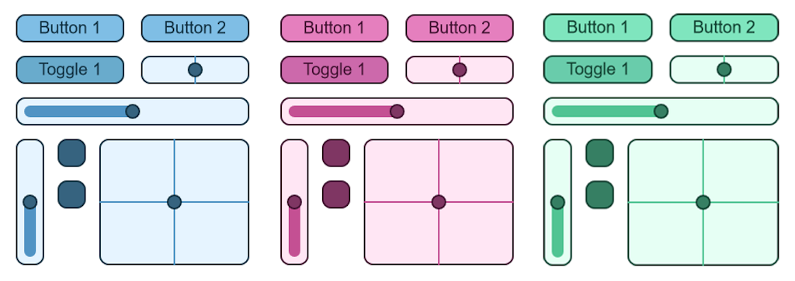
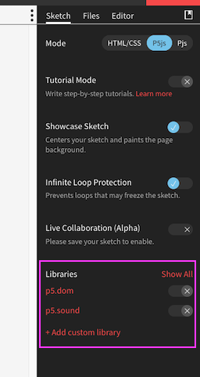

**Introduction to Coding**

Prof. Dr. Lena Gieseke | l.gieseke@filmuniversitaet.de | Film University Babelsberg *KONRAD WOLF*

Winter Term 20/21

---

# Script 10 - Libraries

* [Script 10 - Libraries](#script-10---libraries)
    * [Learning Objectives](#learning-objectives)
    * [Libraries](#libraries)
        * [Examples](#examples)
    * [Using Libraries in OpenProcessing](#using-libraries-in-openprocessing)
    * [Summary](#summary)

---

## Learning Objectives

With this script you

* get to know external libraries, and
* know how to include them in OpenProcessing.

## Libraries

The same way p5 is written to extend the base functionality of JavaScript, we can write code that further extends p5. A library is code in regard to a certain topic, e.g. sound, that is somewhat generalized and of use in various contexts. Libraries should be compact and also as small as possible. That is one of the reasons why additional libraries are not simply added to p5 itself. Also, libraries are mostly written by other people or teams and it is easier to manage to keep the development of an additional library separated.

You can find a list of the currently supported p5 libraries here: https://p5js.org/libraries/

### Examples

One of my favorite p5 libraries at the moment, is [ml5](https://learn.ml5js.org) for using machine learning in an accessible and easy way.

 [[ml5]](https://learn.ml5js.org)

A library to create a [scribble effect](https://github.com/generative-light/p5.scribble.js):

 [[p5.scribble]](https://github.com/generative-light/p5.scribble.js)

A library to create a [a touch gui](https://github.com/L05/p5.touchgui):

 [[p5.touchgui]](https://github.com/L05/p5.touchgui)

Depending on your tasks, using a library can make your life much easier. In coding, you never want to reinvent the wheel (well, I guess that applies to life in general ;) ).

If a library is listed on the official p5 website, you can be fairly certain that it is of a certain quality. However, keep in mind that code structure and its documentation might be different from what you are used to from p5. Again, libraries are usually not coming from the p5 team.

## Using Libraries in OpenProcessing

OpenProcessing makes is rather easy for us to use a library. Go the menu on the right side of a sketch and go to the `Sketch` tab. At the bottom you see a list of supported libraries, which you can simply select to use it in your current sketch.

## Summary

* Libraries extend the p5 library in regard to one specific topic.  
* You have to activate a library for a sketch in openProcessing.  
* For knowing how to use a library you have to refer to the library's given documentation, it is not necessarily on the p5 page.

---

The End

📚 🗃 🤹🏾